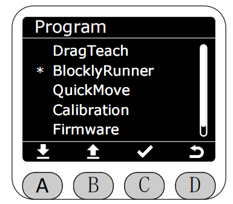
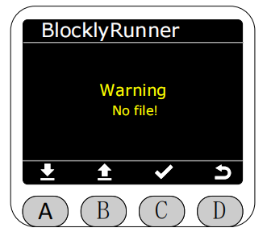
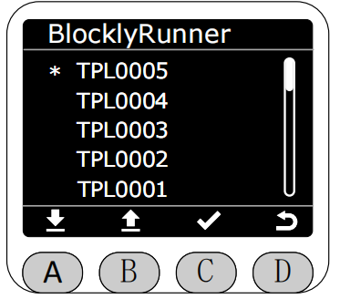

# BlocklyRunner

在Program界面将星号选择为BlocklyRunner功能，按下C键进入BlocklyRunner功能。

进入BlocklyRunner功能后，会先检查myStudio Pro的生产文件夹中是否有已发布的轨迹文件。
**myStudio Pro的生产文件夹中是已经发布的轨迹文件，而测试文件夹中的是还未发布的轨迹文件。BlocklyRunner只会显示已经发布的轨迹文件。**

 

若没有已发布的轨迹文件则会提示相应的错误。此时末端灯带红灯闪烁，间隔1s。

若有，则会在BlocklyRunner界面中显示已发布的轨迹文件，可以选择播放已发布的轨迹文件。

选择已发布的轨迹文件后，会先检查该轨迹文件的状态。

 

若文件正常，按下A键即可开始播放。

**播放时在屏幕的右上角会显示当前的轨迹文件的播放循环状态，灰色表示单次循环播放，白色表示无限循环播放，默认为无限循环播放。**

**在轨迹文件还没有开始执行或停止执行的时候，可按下C键的菜单选项对轨迹文件进行删除，单次播放，循环播放的操作。**

若选择循环播放，则在轨迹文件播放完成后，会自动重新开始播放。同时箭头所指图标将会变为白色。

若选择单次播放，则在轨迹文件播放完成后，会自动停止播放。同时箭头所指图标将会变为灰色。

播放状态下再次按下A键可暂停播放。

按下B键即可停止播放。

若选择删除轨迹文件。

点击删除时,会提示是否确认删除该轨迹文件。

确认后,会弹出删除成功的提示。进行删除操作后，myStudio Pro的生产文件夹中对应的轨迹文件也会同步删除。删除后需要手动返回，此时返回会跳转至读取myStudio Pro生产文件夹的界面。

若想恢复被删除的文件可从myStudio Pro的回收站进行恢复,详情可查阅[该章节](../5.3-myStudioPro/5.3.2-myBlockly.md)。

[← 上一页](./5.2.1-dragteach.md) |[下一页 →](./5.2.4-quickmove.md)