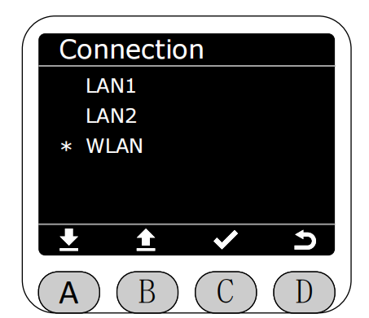

# 无线连接状态(Connection)

在Program界面将星号选择为Connection功能，按下C键进入Connection功能。

进入Connection功能后,可选择对应的网络接口以显示当前机械臂网络接口的配置信息。

其中LAN1是静态IP地址。

选择后,会显示当前网络接口的详细配置信息。

其中LAN1是静态IP地址。

选择后,会显示当前网络接口的详细配置信息。

LAN2是静态IP地址。

选择后,会显示当前网络接口的详细配置信息。

选择WLAN选项。

选择后,会显示当前网络接口的详细配置信息。

[← 上一页](./5.2.6-firmware.md) |[下一页 →](./5.2.8-Q&A.md)
