# 设置

## 1 界面介绍

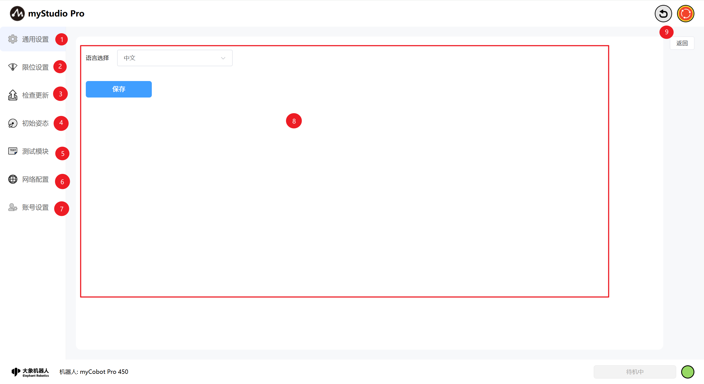

<table>
  <colgroup>
    <col style="width: 80px;" />
    <col />
  </colgroup>
  <thead>
    <tr>
      <th>序号</th>
      <th>功能介绍</th>
    </tr>
  </thead>
  <tbody>
    <tr>
      <td>1</td>
      <td>通用设置模块，主要设置语言</td>
    </tr>
    <tr>
      <td>2</td>
      <td>限位设置模块</td>
    </tr>
    <tr>
      <td>3</td>
      <td>检查更新模块</td>
    </tr>
    <tr>
      <td>4</td>
      <td>初始姿态模块</td>
    </tr>
    <tr>
      <td>5</td>
      <td>测试模块</td>
    </tr>
    <tr>
      <td>6</td>
      <td>网络配置模块</td>
    </tr>
    <tr>
      <td>7</td>
      <td>账号设置模块</td>
    </tr>
    <tr>
      <td>8</td>
      <td>模块内容显示区域</td>
    </tr>
    <tr>
      <td>9</td>
      <td>退出设置</td>
    </tr>
  </tbody>
</table>

## 2 通用设置

点击 `通用设置` 图标按钮，将进入语言设置页面，语言选择支持`中文`和`英文`。

选择对应语言之后，点击 `保存` 按钮，会出现二次确认提示信息弹窗，点击确认，即可成功设置语言。

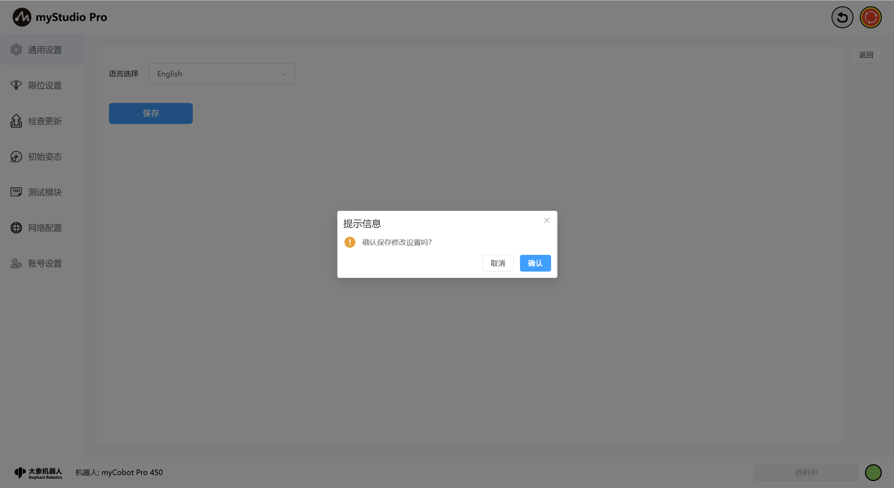

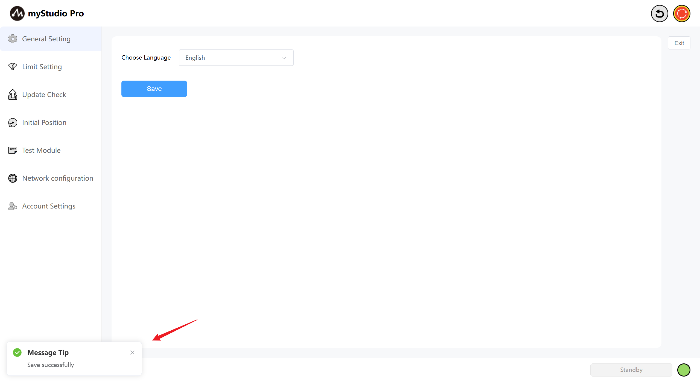

## 3 限位设置

> 注意：限位参数修改仅支持关节的最小角度和最大角度，其它参数均不支持修改。

点击 `限位设置` 图标按钮，将进入关节限位设置页面。`限位设置` 界面默认显示当前机械臂的关节限位和坐标限位的相关参数。

`参数锁定` 按钮默认处于锁定状态，按钮颜色为蓝色，代表不能修改限位参数。

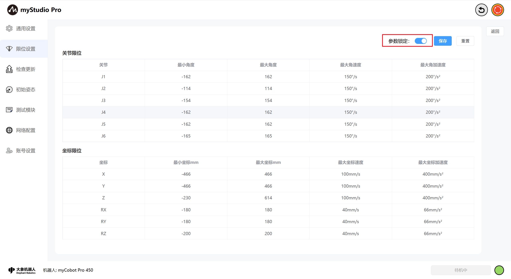

当处于参数锁定状态时，点击 `参数锁定` 按钮，按钮颜色变成灰色，此时处于开锁状态，代表可以修改限位参数（仅能修改最小角度和最大角度的数值）。

点击 `保存` 按钮，根据弹窗的提示定义文件名，即可将当前限位页面的参数保存到本地文件（json文件），并且设置机械臂的关节限位，设置成功后页面会有消息提示。

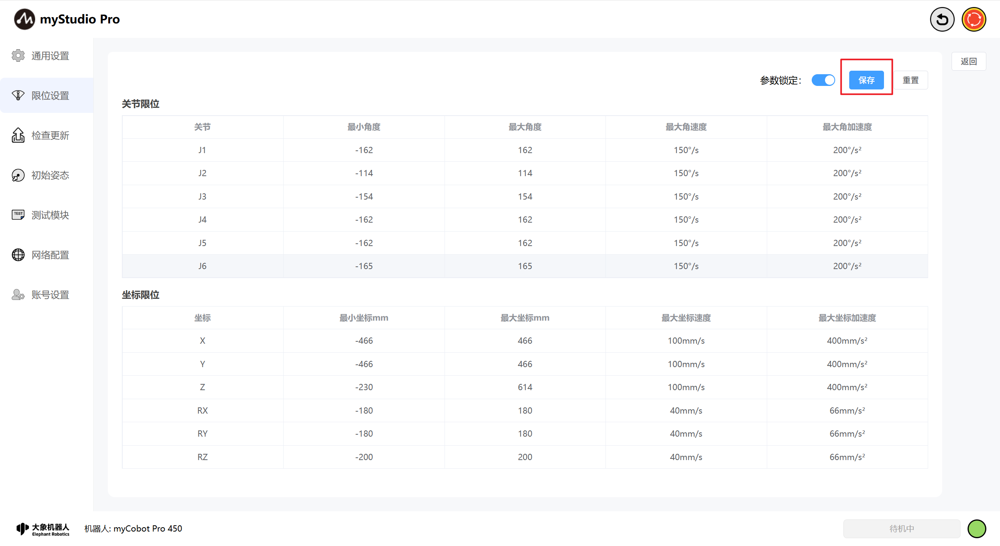

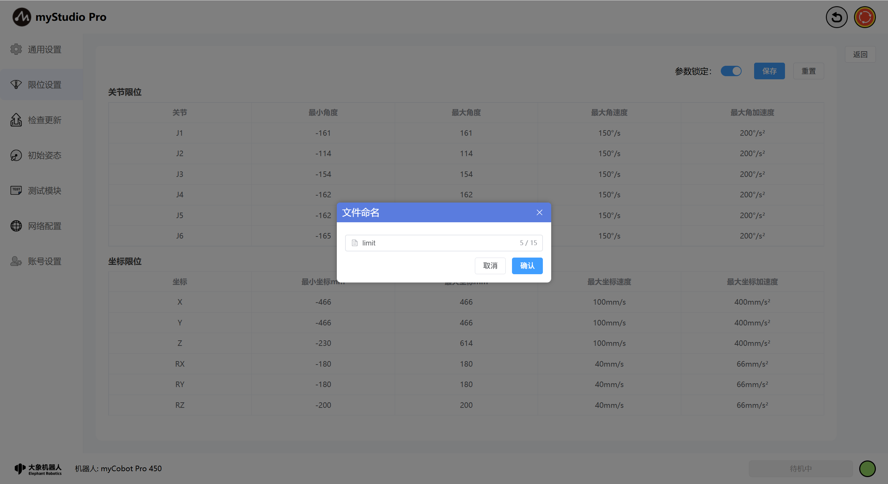

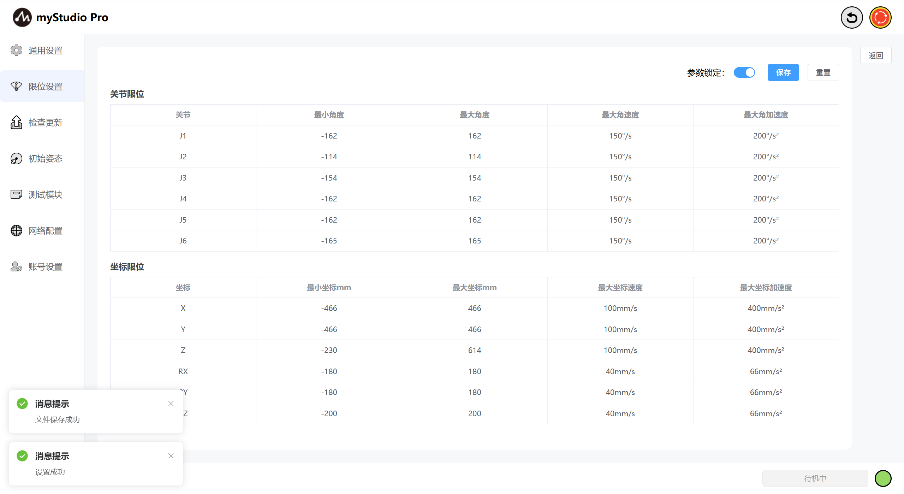

点击`重置`按钮，将所有关节、坐标限位恢复至默认设置。点击时提示`是否恢复默认设置`。
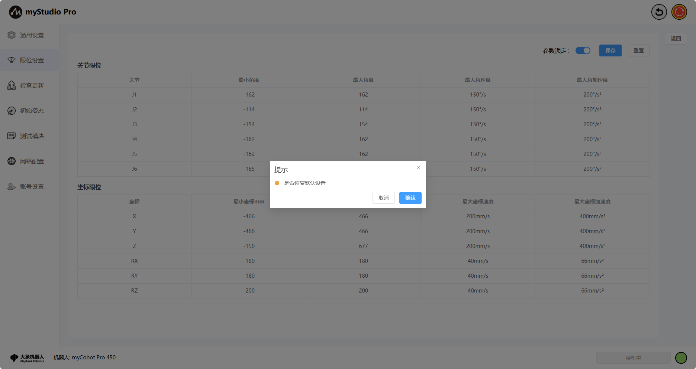

点击`确认`时，提示`设置成功`

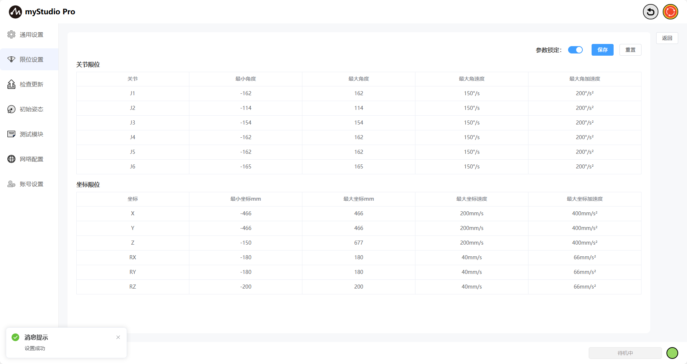

## 4 检查更新

点击 `检查更新` 图标按钮，将进入检查更新状态页面。

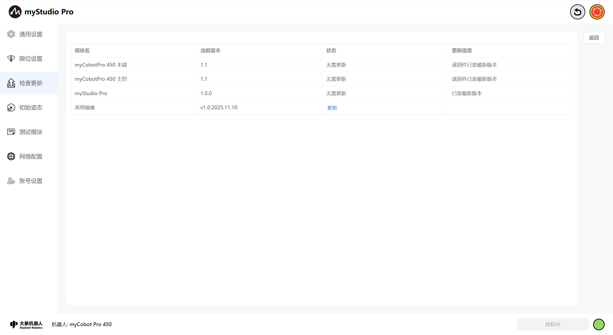

更新页面主要检查机械臂的末端固件、主控固件和myStudio Pro版本状态。

如果检查到机械臂的对应固件或软件不是最新版本时，将会提示需要更新的信息，同时状态项会高亮显示"需要更新"文字，点击即可开始对应更新功能。

此外，该页面还提供了系统镜像升级按钮，该项包含当前版本显示，点击更新会有内容弹窗，详见内容弹窗文字说明，点击<系统镜像升级章节>可进行跳转具体升级步骤可在跳转页查看。

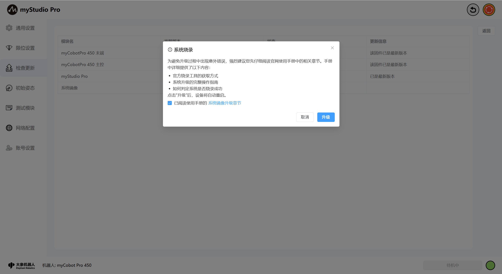

## 5 初始姿态

点击`初始姿态`图标按钮, 将进入初始姿态页面，该页面包含`初始姿态`和`打包姿态`内容，可通过切换按钮对需访问的内容进行切换。

初始姿态页面：显示机械臂的初始姿态模型图、关节角度信息和坐标姿态信息。

打包姿态页面：显示机械臂的打包姿态模型图、关节角度信息、打包按钮此按钮为功能按钮，点击该按钮时机械臂将运动到打包姿态。

## 6 测试模块

点击 `测试模块` 图标按钮，将进入测试页面。

`测试` 页面：主要测试机械臂的通讯连接、固件版本、舵机等状态。

点击 `开始检测` 按钮，即可开始进行测试。

测试完成后，点击 `保存测试日志`  按钮，根据弹窗提示信息，即可将测试结果保存到本地日志文件。

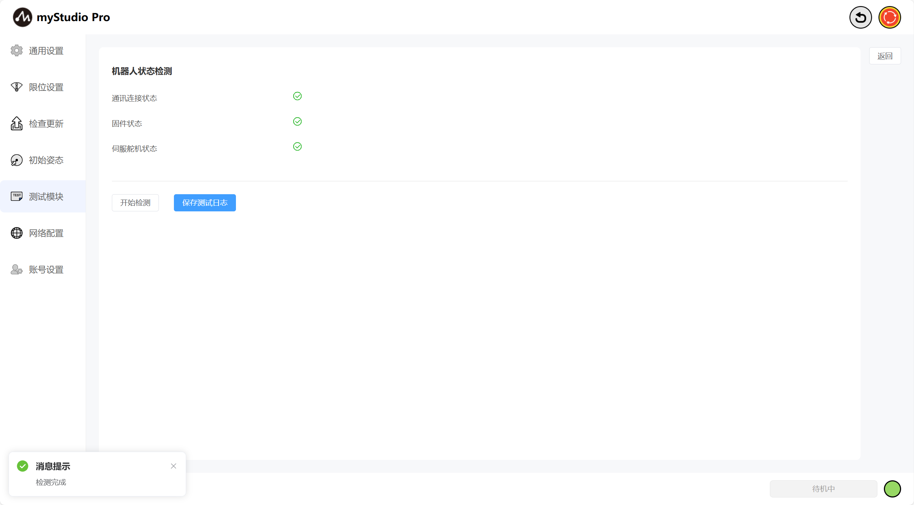

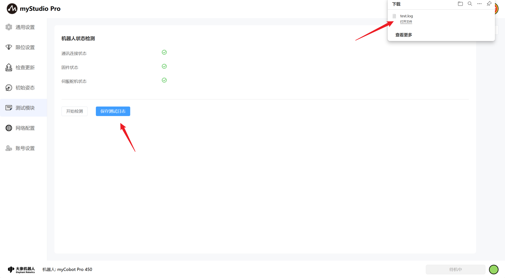

## 7 网络配置

点击 `网络配置` 图标按钮，将进入网络配置页面，该页面主要展示机械臂网口信息，包括LAN1、LAN2和WLAN。

> 注意：页面内容是实时展示的，当且仅当网口被使用时才会显示对应的网口信息。

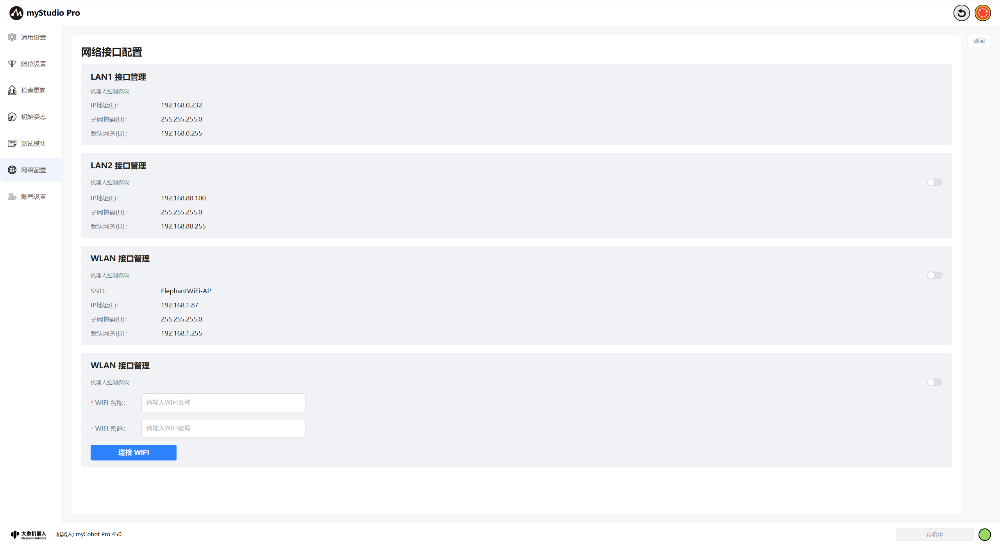

同时，可以在该页面进行WiFi连接操作，输入您要连接的WiFi账号和密码点击`连接WIFI`按钮即可连接WiFi。

此外，在该页面可以对该网口的机器人控制权限进行修改，当机器人控制权限未开启，访问myStudio Pro时会显示没有控制权限。当且仅当控制权限被打开才能正常使用myStudio Pro。

**以下基于WLAN网口对该页面功能进行说明**，LAN2网口控制逻辑同理。

浏览器中，输入WLAN网口的IP地址访问myStudio Pro（已连接WIFI & 未开启控制权限）。

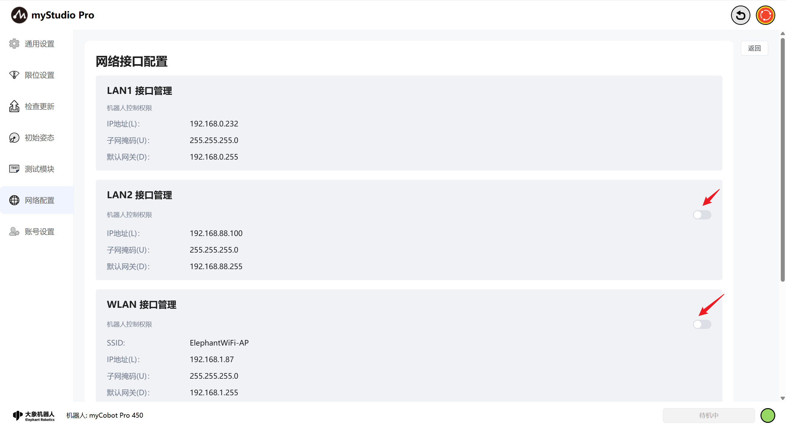

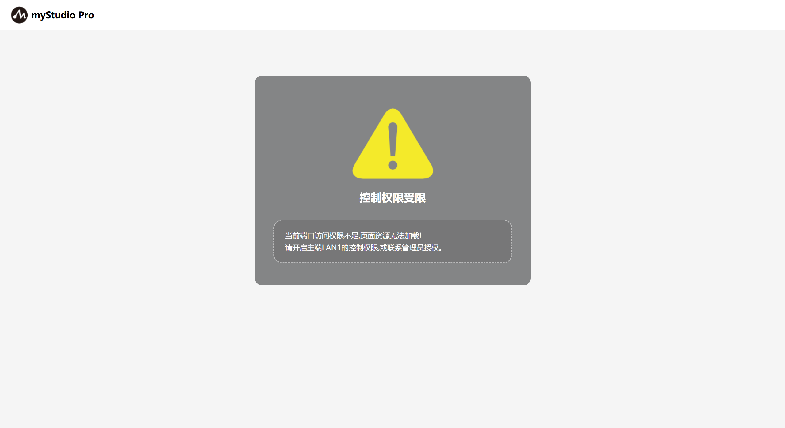

对控制权限`开启`/`关闭`时会对该操作进行二次确认，点击确认后，即可成功开启/关闭控制权限。

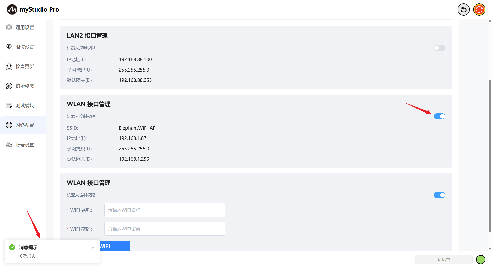

浏览器中，输入WLAN网口的IP地址访问myStudio Pro（已连接WIFI & 开启控制权限）。此时会先进入账号登陆页面，输入正确的账号名和密码后，即可正常使用myStudio Pro，默认账号和密码是`admin`、`123`，倘若您修改了账号密码（修改方式详见第8点说明），请使用修改后的账号密码登陆，否则无法正常使用myStudio Pro。

成功登陆后会对先检测是否有网口正在使用myStudio Pro，有则进行二次登陆确认，点击确认后，正在使用的网口将自动下线，即可正常使用myStudio Pro。点击取消则返回登陆页。反之，则直接进入myStudio Pro主界面。

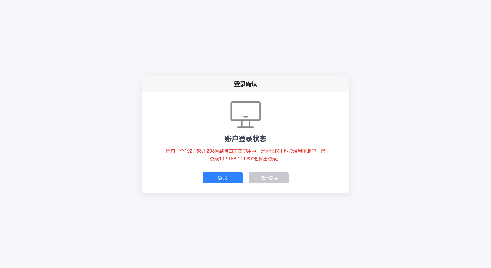

## 8 账号设置

点击`账号设置`图标按钮，将进入账号设置页面。该页面主要用于设置使用LAN2或者WLAN网口登陆myStudio Pro时的账号名和密码。当账号名和密码保存成功时，下次登陆myStudio Pro时，将使用该账号名和密码进行登陆，否则将无法正常使用myStudio Pro。

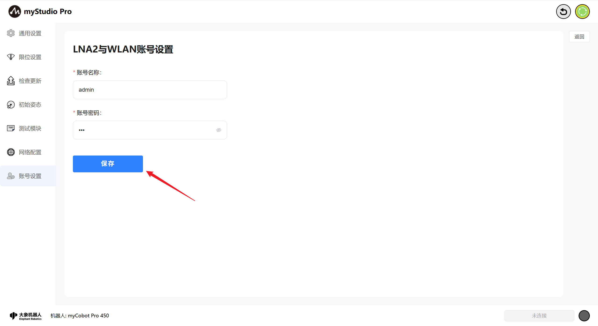

[← 上一章](./5.3.4-resource.md) | [下一章 →](./5.3.6-modbus.md)