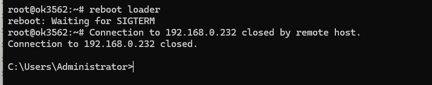
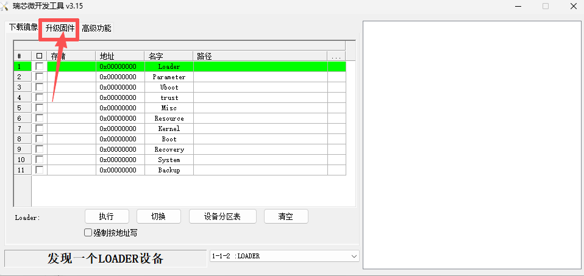
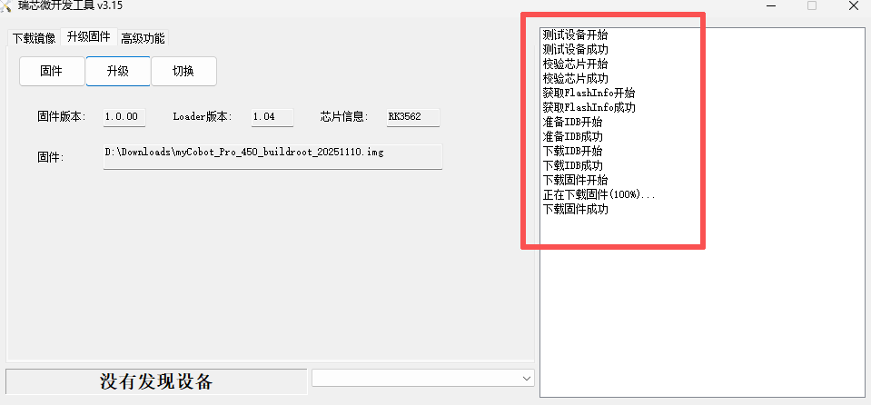
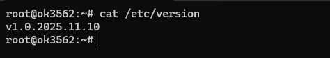

# Pro450系统镜像烧录说明

>> **注意：** 系统镜像烧录完成之后，机械臂各关节需要**重新校准零位**才能正常使用，请查看 [5.5-零位校准](./5.5-set_joint_zero.md) 章节内容。

本章节将指导您如何在 PC 端 使用烧录工具，将系统镜像正确烧录至 Pro450 主控设备。请严格按照步骤进行，确保烧录过程安全、顺利。

## 1 准备工作

在开始烧录之前，请确保以下硬件与软件准备齐全：

### 硬件需求

| 设备 | 数量 | 用途说明 |
|------|------|----------|
| Windows PC | 1台 | 运行烧录工具和驱动安装 |
| 双头 USB 数据线 | 1条 | 连接 PC 与 Pro450 |
| Pro450 机器人 | 1台 | 待烧录设备 |
| 稳定电源 | 1套 | 为 Pro450 供电（保持通电） |
| 急停开关 | 1个 | 安全保护 |
| 网线 | 1条 | 连接机械臂与 PC |

### 软件需求

- 官方提供的 系统镜像文件

- 烧录工具（例如：RKDevTool_Release_v3.15，以实际为准）

- 对应的 USB 驱动程序（设备通常为 USB 转串口 Driver）

>> 🔔 提示： 建议将所有工具放在同一个文件夹中，避免路径中出现中文或空格。

### 网络配置

- MyCobot Pro 450 默认 IP 地址：`192.168.0.232`  
- 默认端口号：`4500`  
- **注意**：PC 端需要将本机网卡 IP 设置为 **同一网段**（例如 `192.168.0.xxx`，`xxx` 为 2~254 之间的任意数，且不能与机械臂冲突）。  
- 示例：  
  - 机械臂 IP：`192.168.0.232`  
  - PC IP：`192.168.0.100`  
  - 子网掩码：`255.255.255.0`

- **验证**：完成网络配置后，可在 PC 终端执行以下命令，若能成功返回数据包，则说明网络连接正常：  

  ```bash
  ping 192.168.0.232
  ```

## 2 系统镜像下载

点击下载镜像：[myCobot_Pro_450_buildroot_2025251230.img](https://download.elephantrobotics.com/Product_software/iMage-ISO/myCobot-Pro-450/myCobot_Pro_450_buildroot_20251230.zip)

## 3 安装 USB 驱动程序

- 点击下载驱动：[DriverAssitant_v5.12.zip](https://download.elephantrobotics.com/software/MyCobot%20Pro%20450/DriverAssitant_v5.12.zip)

- 驱动下载之后，解压并打开提供的 `DriverAssitant_v5.12` 文件夹

- 双击运行 `DriverInstall.exe` 进行安装即可

<video id="my-video" class="video-js" controls preload="auto" width="800"
poster="" data-setup='{"aspectRatio":"16:9"}'>

<source src="../../resources/5-BasicApplication/5.9-system_flash/system_driver.mp4"></video>

## 4 安装烧录工具

- 点击下载烧录工具：[RKDevTool_Release_v3.15.zip](https://download.elephantrobotics.com/software/MyCobot%20Pro%20450/RKDevTool_Release_v3.15.zip)

- 驱动下载之后，解压并打开提供的 `RKDevTool_Release_v3.15/RKDevTool_v3.15_for_window` 文件夹

- 双击运行 `RKDevTool.exe` 打开即可

<video id="my-video" class="video-js" controls preload="auto" width="800"
poster="" data-setup='{"aspectRatio":"16:9"}'>

<source src="../../resources/5-BasicApplication/5.9-system_flash/system_flash_tool.mp4"></video>

## 5 连接 Pro450 设备

- 使用 双头 USB 数据线 将设备与 PC 相连


- 双头USB线一端连接电脑，另一端连接Pro450机器底座的`USB1`接口（上面的USB口）


- 确保 Pro450 已通电并使用网线与电脑连接

- PC电脑远程ssh登录Pro450系统执行烧录命令

## 6 SSH远程连接登录

使用`Win + R`快捷键打开`cmd`面板，输入以下命令：

```bash
ssh-keygen -R 192.168.0.232

ssh root@192.168.0.232
```

按照提示输入`yes`, 然后再输入登陆密码`root`即可


## 7 启动系统烧录功能

SSH远程连接登录之后，输入下面命令启动系统烧录功能：

```bash
reboot loader
```



## 8 启动烧录工具

在**步骤7**启动系统烧录功能之后，打开烧录工具将会看到如下图：


- 点击 `升级固件`按钮

  

- 点击 `固件`按钮，打开文件资源管理器，选择烧录的系统镜像文件，然后点击 `打开`。

  

  

- 选择镜像文件之后，点击 `升级`按钮。

  

- 系统镜像烧录完成之后，烧录工具右侧将有提示信息：

  

## 9 验证系统镜像烧录

烧录系统镜像之后，重新使用SSH远程连接机械臂系统，输入下面命令查看系统版本号：

```bash
cat /etc/version
```



系统镜像文件名称与系统版本号关联，若输出的版本号与镜像文件的日期名称一致，代表系统镜像烧录成功。

>> **注意：** 系统镜像烧录完成之后，机械臂各关节需要**重新校准零位**才能正常使用，请查看 [5.5-零位校准](./5.5-set_joint_zero.md) 章节内容。

---

[← 上一章](./5.3-myStudioPro/5.3.7-Q&A.md) | [下一章 →](../6-SoftwareDevelopment/README.md)
