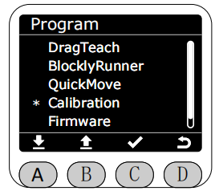

# 零位校准(Calibration)

在Program界面将星号选择为Calibration功能，按下C键进入Calibration功能。该界面及其子界面下末端灯带全程绿灯常亮。

进入Calibration功能后，通过A、B键可选择想要校准的关节。

选中后,该区域颜色会反转高亮。随后可通过A、B键对选中的关节进行转动操作，短按时步距角为0.1°,支持长按，长按时机械臂会以10的速度转动。
运动至想要校准的零位位置后，按下C键进行保存,此时屏幕中对应的关节角度数据会直接变为0°。

[← 上一页](./5.2.4-quickmove.md) |[下一页 →](./5.2.6-firmware.md)
