# 固件与应用

## 1 界面介绍

首页如下图：

myCobot Pro 450支持用户远程升级并且烧录最新版本的主控、末端和屏幕固件，机器出厂默认是使用的最新版本的固件，后续有新版本的固件发布，只需要在使用myStudio Pro时保持网络畅通连接，myStudio Pro会自动下载最新版本的固件信息。

## 2 通用固件

功能介绍：

#### **mainControl**

主控固件名称

**版本号**

默认是最新已经发布的固件版本，也可以选择其他的版本进行烧录。

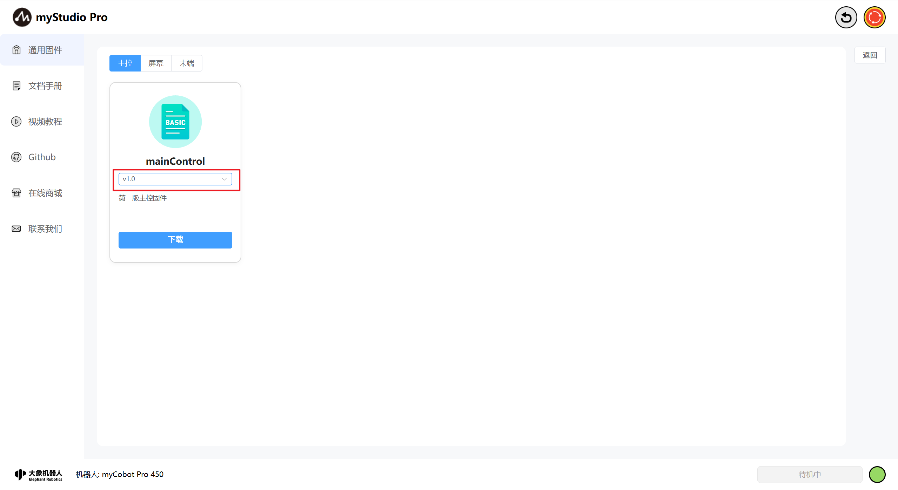

**描述信息**

固件对应版本的描述信息，一般会包含此版本固件的更新信息。

**删除**

删除按钮：固件删除按钮，用于删除存储在本地指定版本的固件。

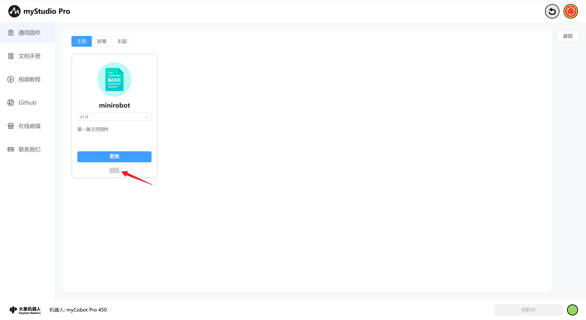

点击此按钮，会弹出提示信息，提示你确认是否要删除固件，点击"确定"按钮，表示确认删除；点击"取消"按钮，表示取消删除。

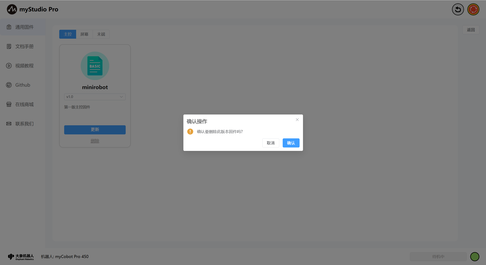

**下载**

当有未下载的固件或者删除固件以后，**烧录/更新**按钮就会变成**下载**按钮，并且**删除**按钮会消失，点击**下载**会自动下载固件。

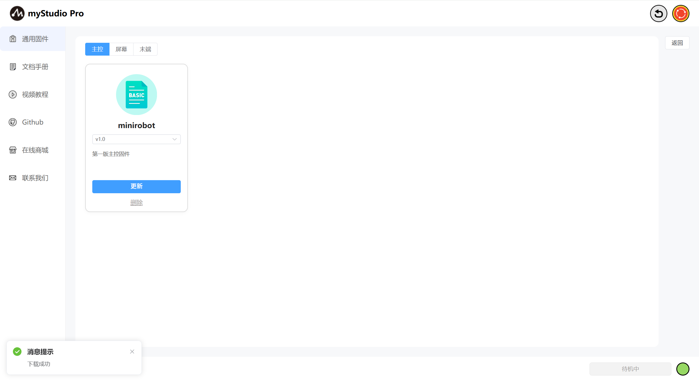

下载完成以后，会恢复"**烧录/更新**"和"**删除**"按钮，点击更新按钮将进行固件更新，页面会有蒙层文字提示，固件更新期间无法操作页面内容，同时请您耐心等待不要关闭页面直到固件完成升级。

#### **Screen**

屏幕固件名称

**描述信息**

固件对应版本的描述信息，一般会包含此版本固件的更新信息。

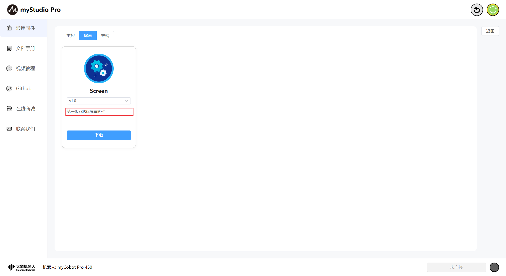

#### **End**

末端固件名称

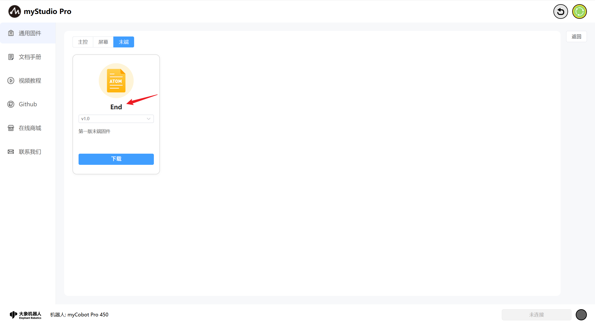

**版本号**

默认是最新已经发布的固件版本，也可以选择其他的版本进行烧录。

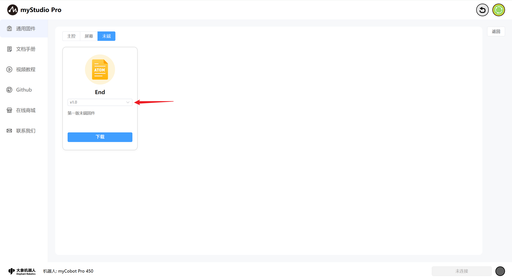

**描述信息**

固件对应版本的描述信息，一般会包含此版本固件的更新信息。

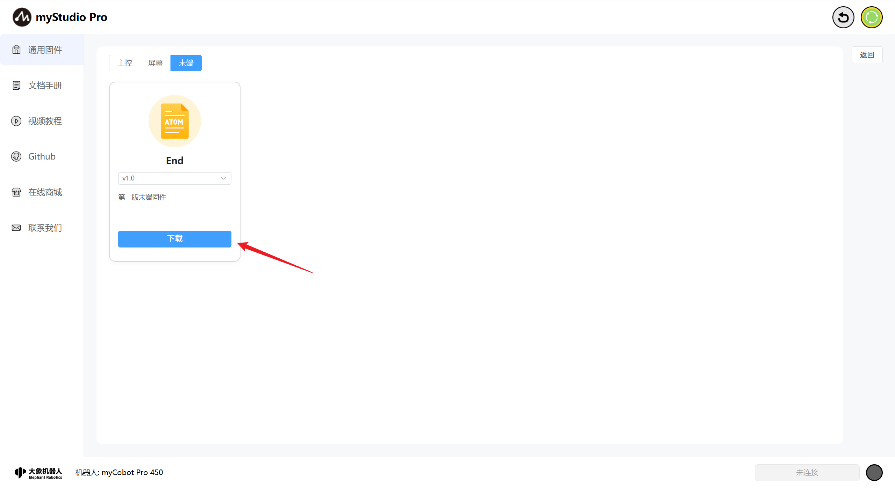

## 3 文档手册

此功能为网页跳转链接，点击以后，会在当前使用浏览器上打开产品的gitbook页面。

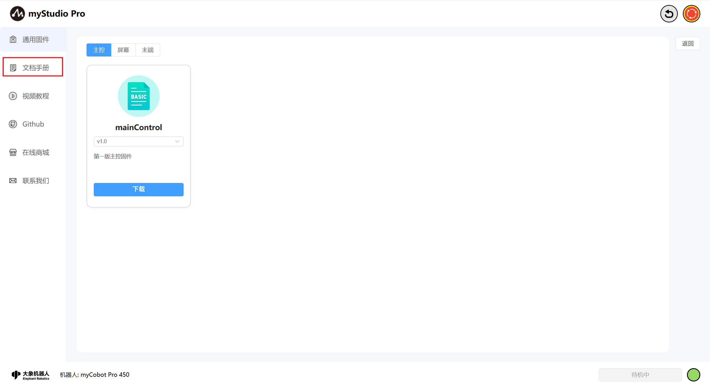

## 4 视频教程

此功能为网页跳转链接，点击以后，会在当前使用浏览器上打开官方的视频号。英文版本会跳转到YouTube，中文版本会跳转到bilibili，并且会以内嵌的形式访问对应链接。

## 5 Github

此功能为网页跳转链接，点击以后，会在当前使用浏览器上打开官方Github。

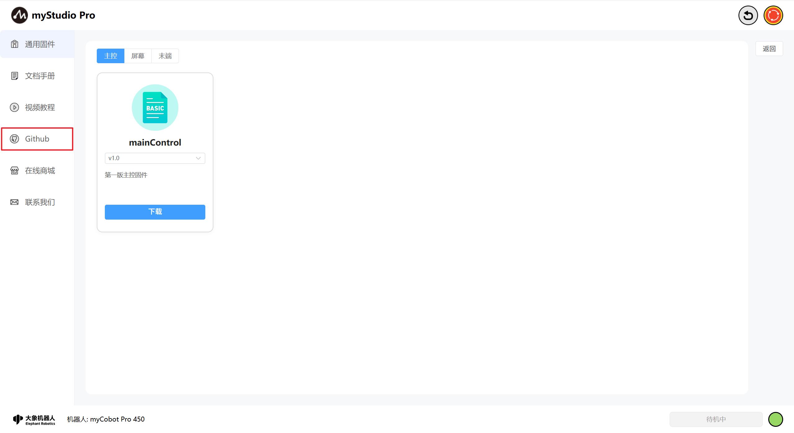

## 6 在线商城

此功能为网页跳转链接，点击以后，会在当前使用浏览器上打开对应产品的购买界面。中文版本会跳转到淘宝，英文版本会跳转到Shopify，并且会以内嵌的形式访问对应链接。

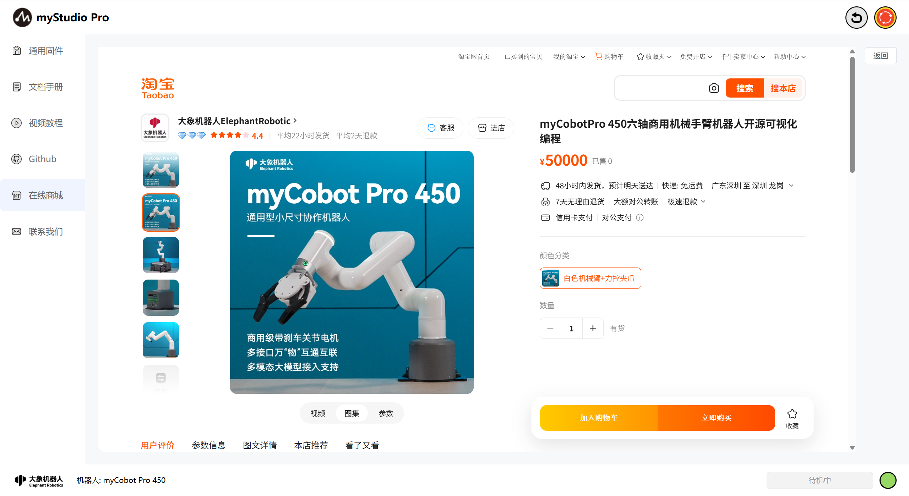

## 7 联系我们

如果你有任何的问题或者想法，可以通过这里来联系我们。

功能介绍：

#### 提交者

这里可以输入您的昵称

> 此处是必填项，如果你不填直接提交，会有对应文字提示您。

#### 电子邮箱

这里可以输入您的电子邮箱

> 此处是必填项，这里可以输入你的邮箱地址，方便官方人员后续回复您，如果你不填直接提交，会有对应文字提示您。

#### 您的意见

这里可以输入您的意见

> 此处是必填项，这里可以输入您的问题或者想法，如果你不填直接提交，会有对应文字提示您。

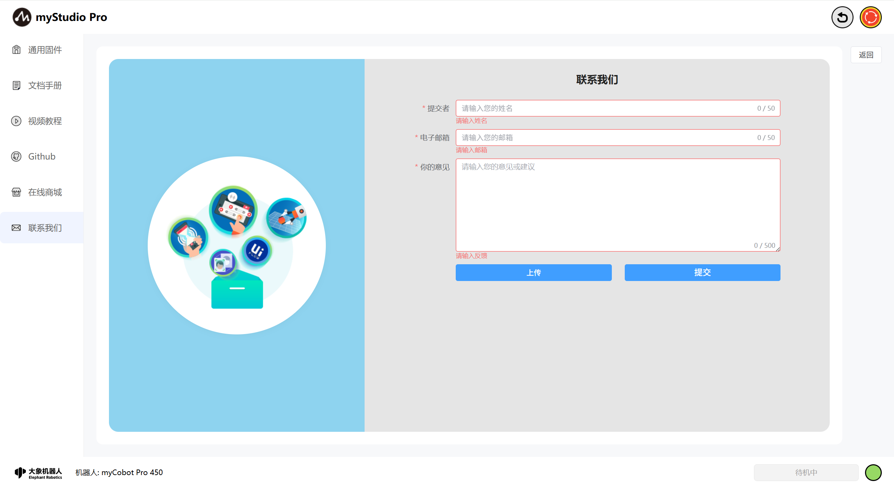

#### 上传

> 点击此按钮，可以上传文件，最多上传3个文件，并且每个文件不得超过50M。

> 点击以后会弹窗以供选择文件。

> 如果你选中的文件大小超过50M，在点击"**打开**"以后，会打开失败，并且弹窗提示你文件过大。

> 当你要上传的文件数量超过3个时，会弹窗提示你。

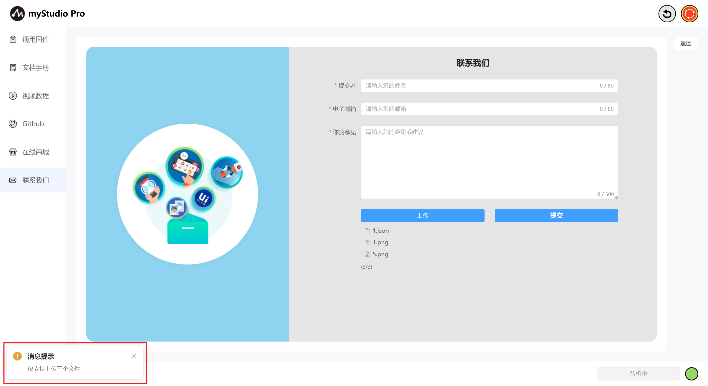

> 注意：上传的文件仅支持.log、.json、视频文件和图片文件

#### 提交

> 点击提交按钮，可以将所有信息进行提交，该步骤需要的时间可能较长，请您耐心等待

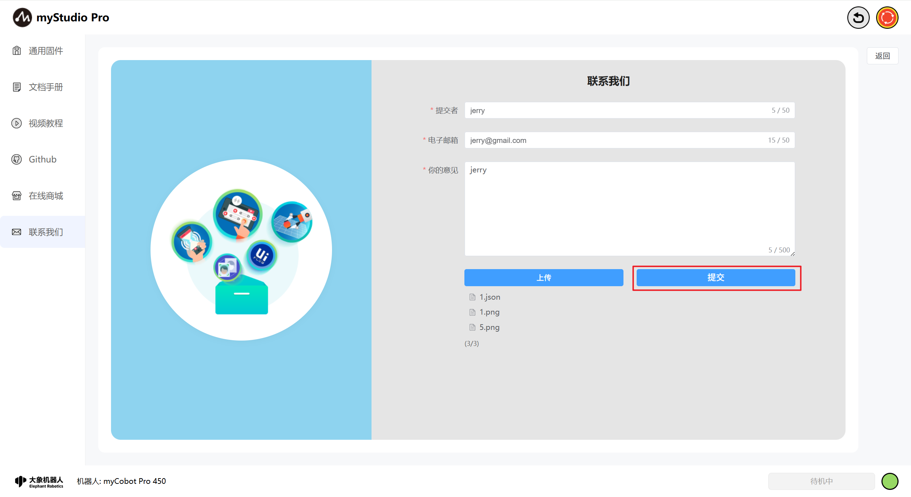

[← 上一章](./5.3.3-quickmove.md) | [下一章 →](./5.3.5-setting.md)