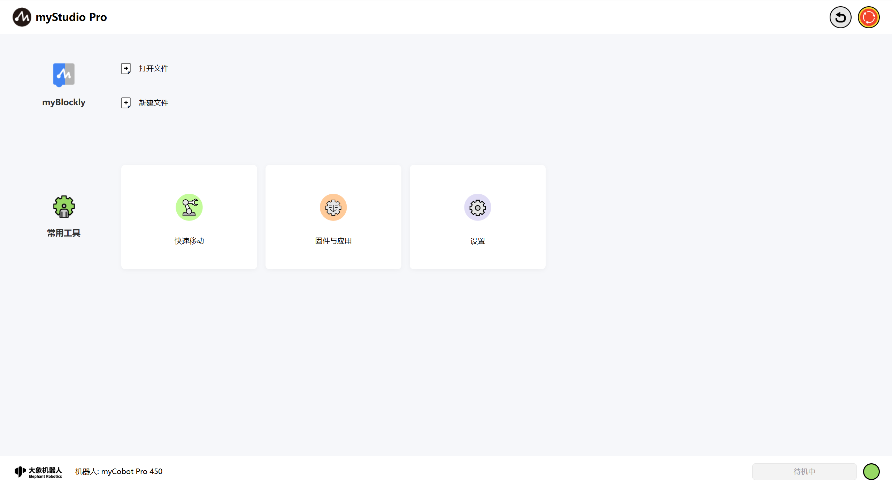
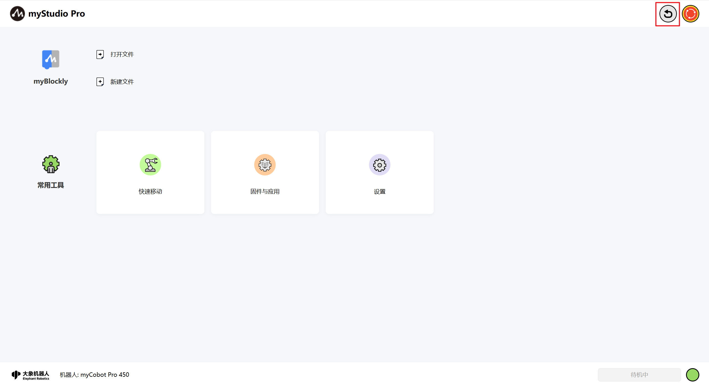
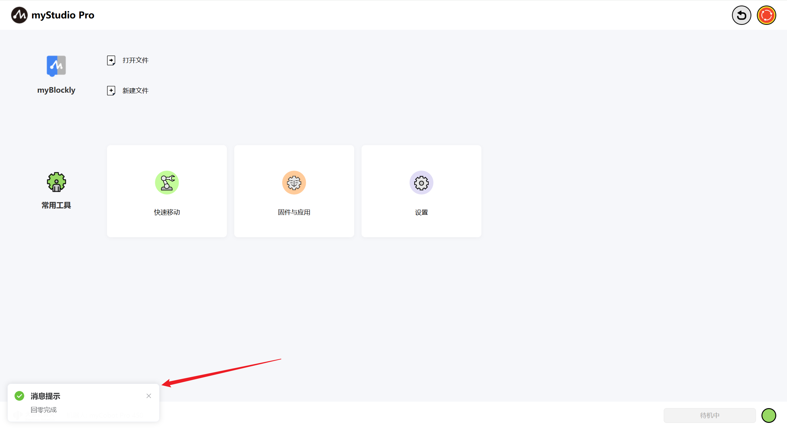
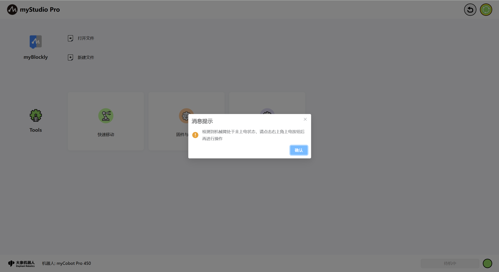
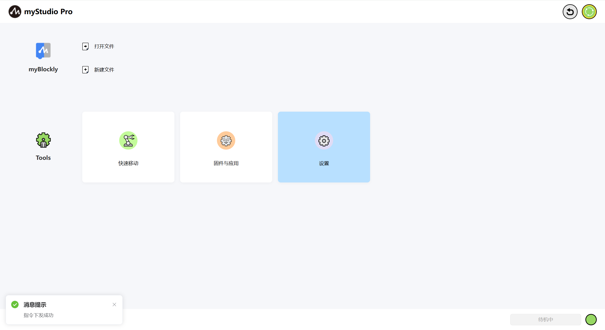
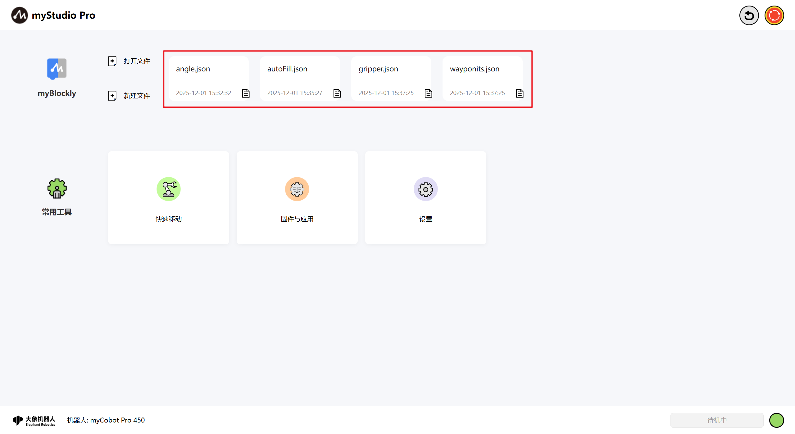
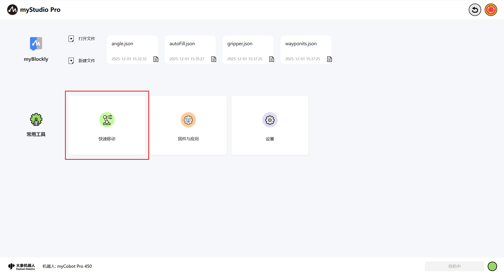
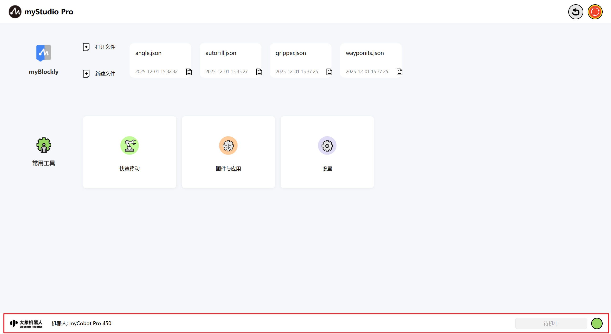

# myStudio Pro 介绍

<!--  -->

**myStudio Pro** 是一款集多功能于一体的机器人编程控制软件，为用户提供可视化编程交互、快捷移动控制、拖动教学、机器人状态查询与配置等一站式解决方案。软件内主要集成四大功能模块：`myBlockly`、`快速移动`、`固件与应用`、`设置`覆盖从编程到调试、从学习到部署的全流程需求。

**myBlockly** 模块在功能与设计理念上借鉴了麻省理工学院开发的儿童编程语言 Scratch，采用图形化积木拼接的方式进行编程。用户通过直观地拖拽模块组合，逐步构建出完整的代码逻辑，整个过程操作简单、易于理解，尤其适合编程初学者和教学场景使用。

从用户体验的角度来看，**myBlockly** 是一款低门槛的可视化代码生成工具，让编程变得像搭积木一样轻松直观。而从开发者的视角来看，该模块实质上是一个能够动态生成结构化代码的文本编辑器，用户通过拖拽交互所生成的代码，最终会转化为可在机器人上执行的指令序列。这种设计与交互方式，不仅降低了使用难度，也保证了程序的专业性与可执行性。

**快速移动**

模块专注于机械臂的快速定位与实时控制，快速移动功能可以快速将机械臂移动到指定位置，可设置末端和底部IO的读写状态，此外，该模块提供专门的操作区域，支持对关节或坐标进行步进式或持续运动控制，实现高精度的位置调整与灵活的运动调试。

**固件与应用**

模块为用户提供便捷的资源导航功能，集中展示常用外部链接入口，包括固件下载、技术文档、官方联系方式等。用户无需手动查找，即可快速访问相关支持材料，提升使用与维护效率。

**设置**

模块涵盖软件与机器人系统的基础配置选项。用户可在此进行语言切换、关节运动限位设置、系统更新检测与更新等操作。

## myStudio Pro 界面的显示和基本功能的使用

打开软件，主界面如下图所示

界面功能介绍，界面分成三个区域：

1. 回零与上下电
2. 功能实现
3. 信息展示

> 注意：软件会自动与机器进行通信连接，若右下角显示未连接请检查PC与机器网络连接是否通畅，或尝试将机器重启。

## 回零

此按钮功能为：控制机器人所有关节都回到零位位置。

**注意**：此按钮功能生效的前提的已经成功连接机器人的通信。鼠标左键长按点击此按钮以后，机器人开始执行回零指令，机械臂将缓慢移动至零位，鼠标长按松开即回零指令停止执行。

回零完成以后，会弹窗提示完成回零。

## 软急停

此按钮功能为：控制机器人整机掉电。访问页面时，会检测当前机器人是否上电，如果已经上电，此按钮为红色状态；如果未上电，此按钮会改为绿色状态并且会以弹窗的形式提示机器人未上电，可以通过点击此按钮来上电。

## 上电

当此按钮为绿色图案时，此按钮的功能为上电。鼠标左键点击此按钮以后，机器人开始执行上电指令，应用整个界面会被一层透明浅灰色的阴影覆盖，上电未结束之前，不得点击界面内的其他功能，并且应用中心位置会显示正在上电的转圈图案提示。

上电完成以后, 图标会变成红色并且弹窗提示。

## 下电

当此按钮为红色图案时，此按钮的功能为下电。鼠标左键点击此按钮以后，机器人开始执行下电指令。

下电完成以后, 图标会变成绿色并且弹窗提示。

## 功能实现

这里可以选择你想要使用的功能，功能包含如下：

> 1. [myBlockly 图形化编程](./5.3.2-myBlockly.md)
> 2. 快速移动
> 3. 固件与应用
> 4. 设置

## myBlockly
`myBlockly`是一个完全可视的模块化编程界面，属于图形化编程语言，适合初级用户熟悉编程。使用者以拖拽拼图的方式开发出应用程序，即可创造出简单及复杂的功能。支持图形化代码的保存、加载、单步调试执行、执行指定的单个积木块等功能。

> 注意：想要使用 myBlockly 必须要先连接设备通信。

#### myBlockly

此处为可点击按钮，鼠标左键点击以后，会跳转到[myBlockly 图形化编程界面](./5.3.2-myBlockly.md)

#### 打开文件

此处为可点击按钮。

点击后会自动跳转到myBlockly并打开文件管理列表，可以基于文件列表进行 JSON 文件相关操作。

#### 新建文件

此按钮与[**myBlockly**](./README.md#myblockly)功能一样。

**快捷载入历史保存的 blockly 文件**

当你在使用过 myBlockly 编程并且已经保存过 blockly 文件，如下图示位置会显示保存的文件名称以及保存时间，显示数量最多为 4 个，如果超过 4 个，只显示最新保存的 4 个。鼠标左键点击可以打开 myBlockly 并且自动加载选中的 blockly 文件。

## 常用工具

#### [快速移动](./5.3.3-quickmove.md)

功能：提供机器人 IO 快捷控制以及关节角度、坐标的快捷控制

<!-- 快速移动[功能详细介绍](./5.3.3-quickmove.md) -->

#### [固件与应用](./5.3.4-resource.md)

功能：提供机器人嵌入式固件的更新升级、产品使用手册、官方视频、官方 GitHub 官方在线商城以及意见反馈功能。

#### [设置](./5.3.5-setting.md)

功能：集成以下核心功能：实时监控机器人状态与信息、一键检查更新应用版本、个性化设置（语言/运动参数）、以及快速配置网络连接与登录账户，助您高效管理机器人系统。

## 信息展示

应用的底层部分，包含大象机器人公司的 logo、当前机器的类型、警报提示以及当前机器人的运行状态。

## 报警提示

功能：展示机器人错误信息，并且鼠标左点击可以打开错误日志窗口。

鼠标左键点击，打开错误日志窗口。

如果机器人在运行的过程中报错，应用就会捕获异常并且显示在错误日志界面中，错误日志表格内含义如下：

- number：错误日志序号
- time：错误发生的时间
- type：出现的错误类型
- description：错误描述信息

应用捕获到错误以后，首先会弹窗提示并且会给出解决方案，如果你不想处理错误，也可以忽略错误。当你断开连接并且重新连接设备或者进入到错误日志界面，点击"清除"按钮以后，会重新弹窗提示并且保存到错误日志表中。

## 机器人状态

功能：显示当前机器人的运行状态

| Color | meaning                                                     |
| ---- | ------------------------------------------------------------ |
| | 未连接 |
|     | 正常待机 |
|     | 正在运动 |
|     | 机器异常  |

---

[← 上一章](../5.1-SystemInstructions.md) | [下一章 →](./5.3.1-myStudioFirstUse.md)