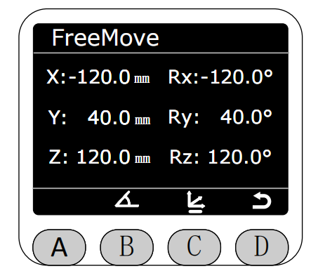

# QuickMove

In the Program interface, select the QuickMove function by clicking the asterisk (*). Press the C key to enter QuickMove mode. Once in this mode, the end light strip will remain constantly lit with a yellow light.

After entering QuickMove mode, you can choose between free movement or joint tapping.

In FreeMove mode, the robot arm's angle data is displayed in real-time by default. Press and hold the buttons on either side of the end effector to freely drag the robot arm. **This will release the brakes on all motors; please be careful.**

Pressing the C key will display the current robot arm's coordinate data in real-time. The end effector light will then turn solid blue; returning to the starting position will display a yellow light.

Return and select JogMove mode

After entering JogMove mode, you can select either the jog angle or the jog coordinate mode.

In angle-based motion mode, the current angle information of the robotic arm will be displayed in real time.

Select the joint you want to move to control the movement of the robotic arm joint; the selected joint will be highlighted. In single-point motion, the step angle is 0.1°. Holding down the press and holding button will rotate the joint at a speed of 10, automatically stopping when it reaches near its limit.

In coordinate jog mode, the current coordinate information of the robotic arm will be displayed in real time.

Select the joint you want to jog to control the movement of the robotic arm joints; the selected joint will be highlighted. In single-point jog mode, the step angle is 0.1°. Holding down the jog button will rotate the joint at a speed of 10, automatically stopping when it reaches near its limit.

When using the jog mode, the robotic arm will automatically stop when it reaches near the limit. A warning message will pop up, and the blue indicator light will remain on. Pressing the C key at this point will return the arm to the previous position.

[← Previous Page](./5.2.3-blocklyrunner.md) |[Next Page →](./5.2.5-calibration.md)