# MyBlockly

`myStudio Pro` is already configured on your machine. You can access it via your PC by opening a browser and using `ip:8000`. After the homepage loads, the system will automatically establish a connection with the machine (default static IP: 192.168.0.232:8000).

You can click the `myBlockly` icon or the `Create File` button to enter the `myBlockly` programming page.

> Alternatively, you can click the `Create File` button to automatically jump to the blockly programming page, loading your saved file content, including the workspace, waypoints, and track file (for information on saving the workspace, [click here](./5.3.2-myBlockly.md#2-basic-function-usage)). 

> Clicking the `myBlockly` icon or the `Create File` button to enter the `myBlockly` programming page is equivalent to creating a new workspace.

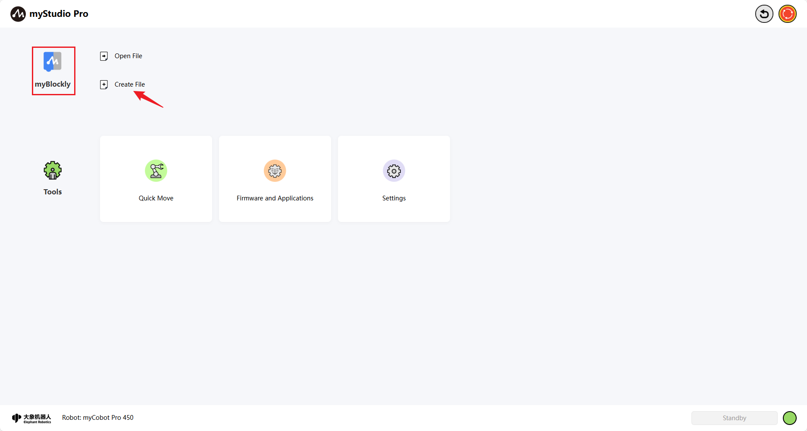

The `myBlockly` homepage is shown below:

 
## 1 Introduction to the myBlockly Main Interface

| Number | Function Introduction |
| ------ | ------------------------------------------------------------ |
| 1 | File: Allows Create, Open, Save, Save As and Case about workspaces;|
| 2 | Quick Control: Powers on/off the robotic arm, releases/tightens joints;|
| 3 | Waypoints&Trajectory: Quickly create and run teaching points, and record and reproduce trajectories; |
| 4 | Quick Move: Used for rapid control of the robotic arm's movement; |
| 5 | Exit: Exit the `myBlockly` main interface; |
| 6 | One-step: Select a block, click the button to execute only the currently selected block; |
| 7 | Run Plane: Open the run plane, where you can run and debug workspace code; |
| 8 | Posture: Open the attitude page to see the real-time simulated motion attitude of the 3D model; |
| 9 | Toolbox: Provides pre-built blocks for users to use; |
| 10 | Workspace Calibration: Clicking this will return the workspace to its origin; |
| 11 | Zoom In: Zoom in on the workspace; |
| 12 | Zoom Out: Zoom out on the workspace; |
| 13 | Trash Can: Blocks in the workspace can be dragged here to delete them, and deleted blocks can also be retrieved from here; |
| 14 | Workspace: Blocks in the toolbox can be dragged here for programming; |

## 2 Basic Function Usage

Let's write a small case study to introduce the basic usage of `myBlockly`

**Case Description:** Control the robotic arm to return to zero, then control one joint to move to a 20-degree position, and then return to zero.

**Step 1:** First, click the `Posture` button to open the attitude view, where you can see the current attitude of the simulated robotic arm.

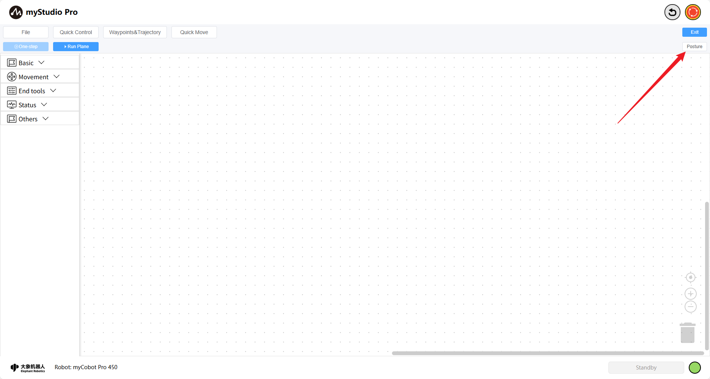

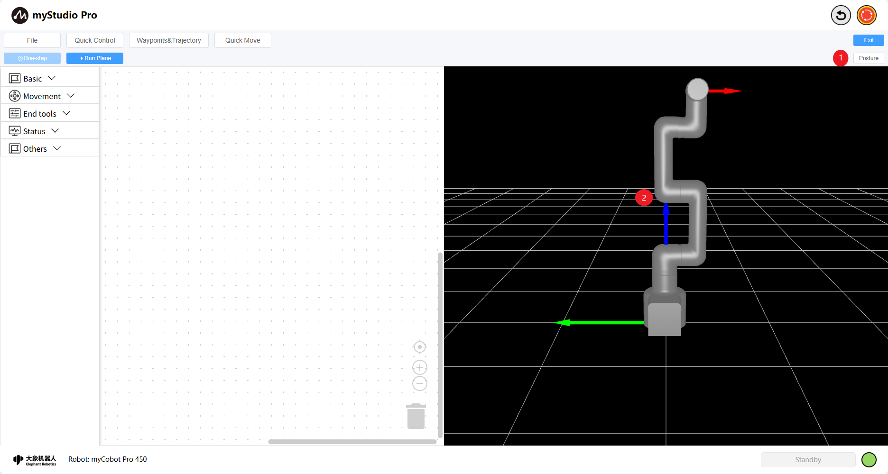

- 1: Switch the posture panel: Click to show when the posture panel is hidden, and click to collapse when it is hidden.

- 2: Robotic arm simulation model, which can simulate motion in real time based on the current actual angle.

**Step Two:** Start Programming

Open the toolbox, first-level category `Movement`, select the second-level category `Angle & Coord`, and drag the `Set Angles` block to the workspace.

This block is used to control the movement of each joint of the robotic arm to a given angle. The default movement speed is 20.

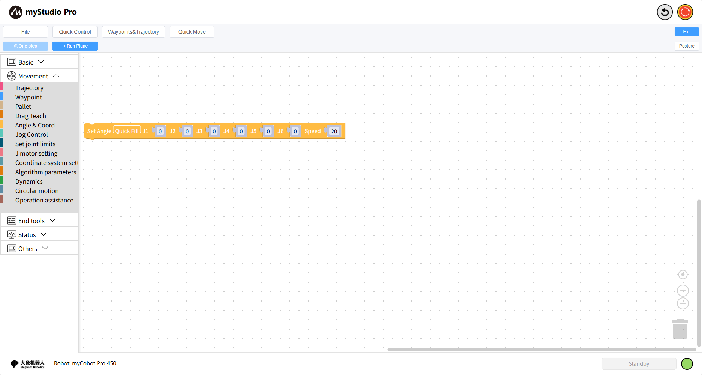

Open the toolbox's primary category `Basic`, select the secondary category `Time`, drag the `Sleep` block to the workspace, and set the sleep time to 3 seconds.

Copy the `Set Angles` block and modify the `J 1` angle to 20:

- Click to select the `Set Angles` block in the workspace;

- Press Ctrl + C to copy the `Set Angles` block;

- Press Ctrl + V to paste the `Set Angles` block;

- Modify the `J 1` angle of the new block to 20;

- Drag the block to connect it to the `Sleep` block;

Similarly, copy the `Sleep` block and set the sleep time to `3`. Seconds;

Copy the first `Set Angles` block in the workspace again;

The complete code is as follows:

> This code means:

>
- Control the robotic arm to return to the zero point 

> - Wait 3 seconds  

> - Move one joint (J1) to a 20-degree position 

> - Wait 3 seconds 

> - Control the robotic arm to return to the zero point 

Finally, click the `Run Plane` button. After opening the panel, click the `Run All` button to start executing the code. The right side of the Run Plane will display the joint and angle coordinates in real time, and the 3D model will also simulate motion.

The code has finished running. Click the `X` on the panel to close it.

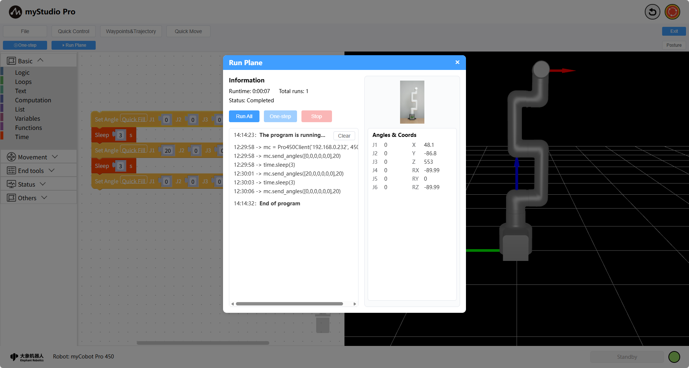

**Step 3:** Saving and Loading Files (or Saving and Loading the Workspace)

`myBlockly` supports saving and loading the workspace.

Click the `File` button, and a drop-down menu will appear. Click the `Save` button, and a file naming modal will appear. Enter your desired name and click Confirm to save (by default, it will be saved to the test space). The saved result will be displayed as a message in the lower left corner.

**Step 4:** Creating a New Workspace (This operation will clear all code in the workspace)

Click the `File` button. A drop-down menu will appear. Click the `Create` button. A prompt will appear. Click the `OK` button.

Workspace creation complete.

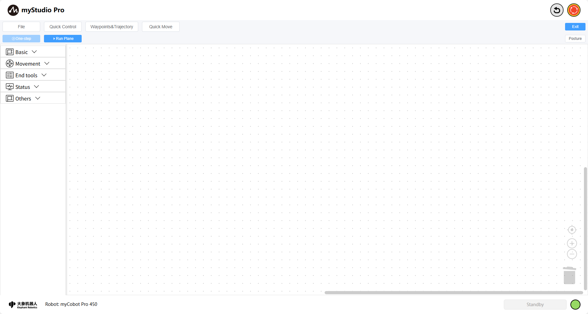

**Step 5:** Load the previously saved workspace file.

Click the `File` button. A drop-down menu will appear. Click the `Open` button in the menu. A list of saved files will be displayed. Select the file you want to load, and use the edit button in the operation column to load the file into the workspace.

 

Loading complete.

## 3 Quick Fill

This chapter introduces the Quick Fill function in the block.

When a block has too many data items, filling them one by one is too tedious. Therefore, for blocks with too many data items, we can use the Quick Fill function.

Quick Fill Source: Angle or coordinate data of the current robotic arm posture.

The following blocks currently support quick fill:

#### How to Use Quick Fill

Taking the `Set Angles` block as an example, first select the block, then click the `Quick Fill` button within it.

When the following prompt box appears on the page, the fill was successful.

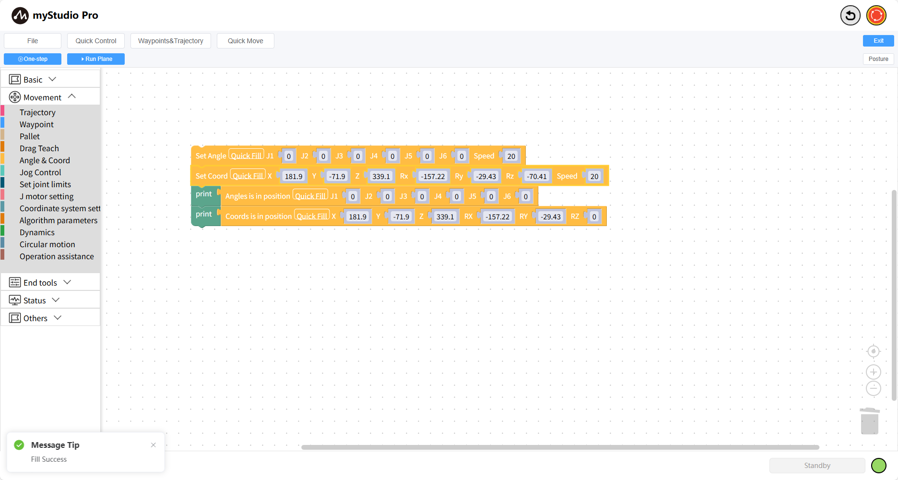

## 4 Quick Move

What is **Quick Move**? Simply put, it's controlling the robot's movement quickly with just mouse clicks, without any programming.

> Note: myStudio Pro has two **Quick Move** control panels; their functions are largely the same.

**Step 1:** Click the **Quick Move** button to open the **Quick Move** panel and wait for the robot data to return.

If all data is zero, please check if the robotic arm is connected and if it is functioning correctly.

**Step 2:** Use the `-` and `+` buttons to control different joints of the robotic arm. Single-point movement, long-press for continuous movement, and direct modification of angles and coordinates followed by pressing `Enter` are supported.

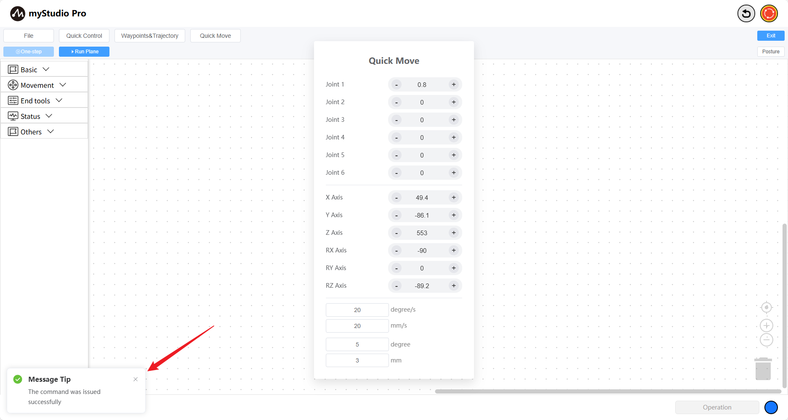

**Step 3:** Control the coordinates.

First, you need to move joint 3 to approximately -90 degrees, as shown in the image below.

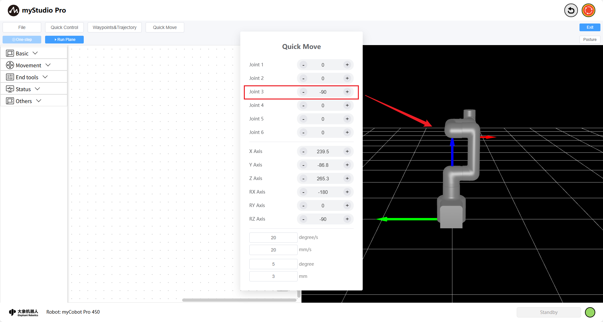

Then you can click the `-` / `+` buttons on different axes to control the coordinates.

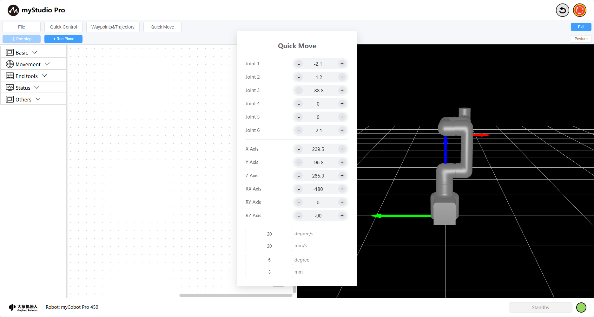

For other functions, please refer to [Quick Move](./5.3.3-quickmove.md)

## 5 Learning to Use Coordinate Control

**Main APIs Involved:**

**Set Coord**

- **Prototype:** `send_coords(values,speed)`

- **Interface Description:** Sets multiple coordinates for the robotic arm

- Parameters:

- values: [X,Y,Z,RX,RY,RZ]

- speed: Speed, range 1-100

**Small Case**

**Some operations to be performed before first using coordinate movement:**

- Return the robotic arm to zero position. Refer to [Controlling the robotic arm to zero](./5.5.3-littleCase.md)

- Set the initial posture of the robotic arm's coordinate movement (machine J3 needs to be parallel to the ground)

- As shown in the code below:

Open the `Run Plane` and run the code.

#### Coordinate Movement

Drag a `Set Coord` block to the workspace, and click the `Quick Fill` button on the block to fill in the data. Change the `Z` axis data to `300`.

The complete code is as follows:

Execute the code; observe the robotic arm moving up and down throughout the process.

## 6 One-step

One-step execution refers to executing one block at a time. When there are many blocks in the workspace, I only want to execute one block to see the effect. This is where you can use the **One-step** button.

> The **One-step** button is disabled by default and cannot be clicked.

**Step 1:** Drag several joint setting blocks into the workspace.

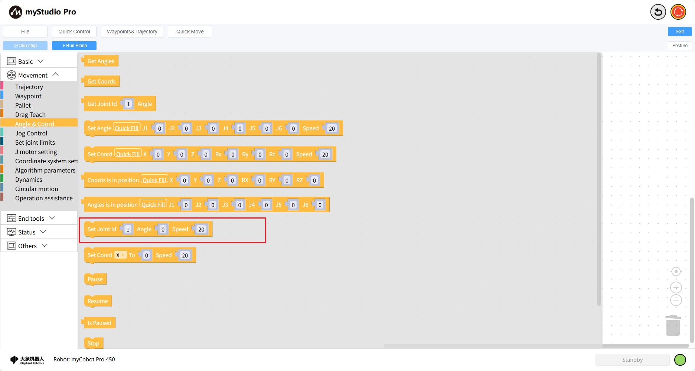

**Step 2:** Select the `Set Joint` block. You will observe that the **One-step** button has been unlocked (its color has changed to a darker shade).

**Step 3:** Click the **One-step** button. This will automatically open the run panel and begin executing the code. Simultaneously, observe the changes in the robotic arm's movement. (Single-step execution sets joint 1 to 30°)

## 7 Program Control

Introduces how to debug block code using the `Run Plane` , enabling program `Pause`, `Recover`, `One-step`, and `Stop`.

Edit a program to control the movement of `joint 1` of the robotic arm.

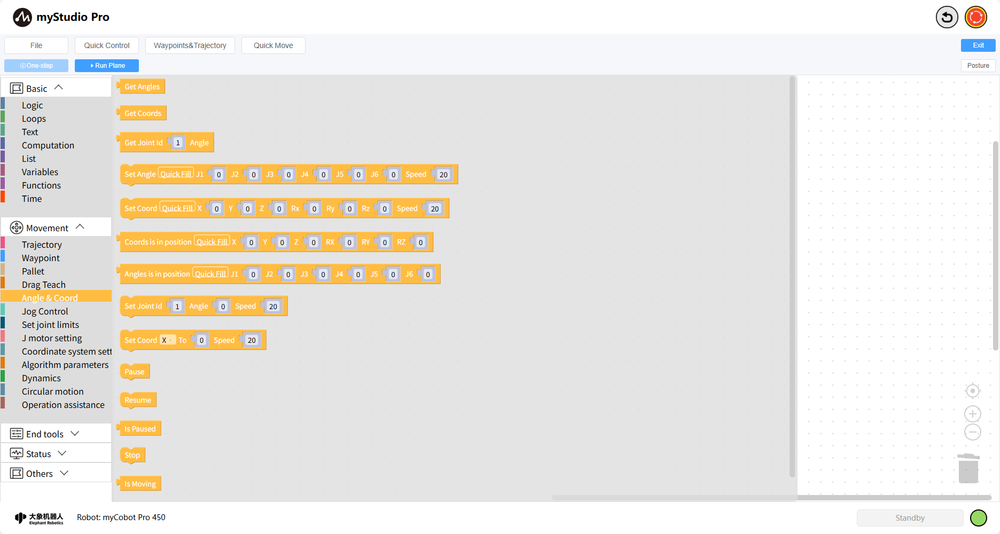

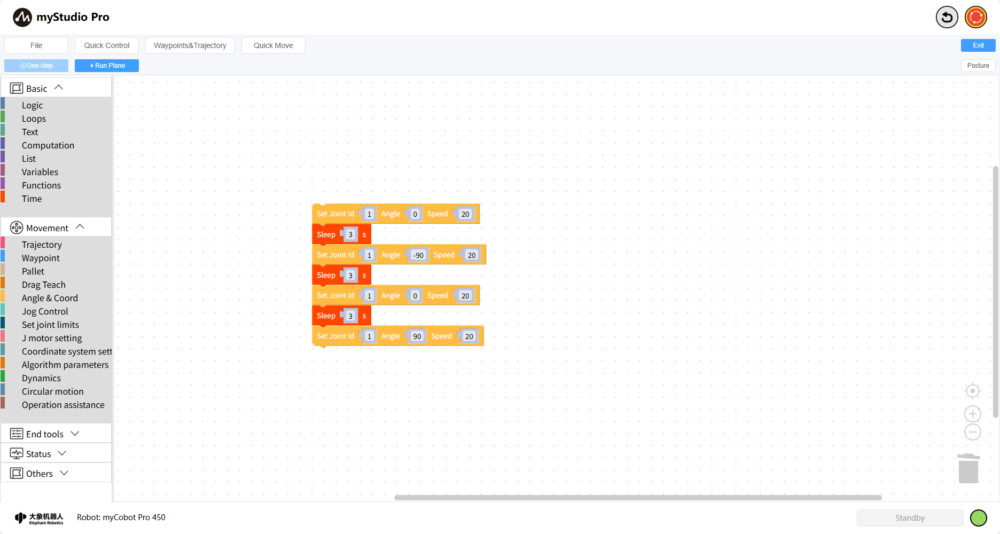

Click the `Run Plane` button. When the Run Plane pops up, click `Run All`, and immediately click the `Pause` button. The program will pause after executing the first instruction `mc.send_angle(1,0,20)`.

The program is paused. The next instruction to be executed, `time.sleep(3)`, appears.

At this point:

- If you click the `Recover` button, the program will automatically continue execution;

- If you click the `One-step` button, The program will execute the `time.sleep(3)` instruction. When `One-step` is clicked again, the program will execute the next instruction, namely `mc.send_angle(1,-90,20)`;

- If you click the `Stop` button, the program will be terminated;

What happens next is up to you!

## 8 Using Drag-and-Teach

This chapter introduces how to use the drag-and-teach function in `myBlockly`.

This refers to the movement of the manipulator along the direction of the operator's force under the operator's traction (traction of the end or traction of a manipulator).

This function makes it easy to plan trajectories (for tasks where the process trajectory accuracy is not high), so that the operator can record and reproduce the trajectory without manual programming, lowering the barrier to entry for operators and improving efficiency.

**API Display**

**Small Case Study**

We will achieve the following effect: A robotic arm can be dragged freely to perform some actions. After dragging, the robotic arm will execute the actions just performed. This is equivalent to recording and playing back a trajectory.

The complete code is as follows:

Code Explanation:

- Record trajectory: After executing this block, the robotic arm's joint brakes release, and the robotic arm can now be dragged.

- Wait 10 seconds (equivalent to recording for 10 seconds)

- Pause recording: The robotic arm's joint brakes lock, and it cannot be dragged manually.

- Wait 10 seconds

- Play trajectory: The robotic arm begins executing the previously recorded trajectory.

- Wait 10 seconds (equivalent to playing back the previously recorded 10-second trajectory)

## 9 Using the Gripper

This chapter introduces how to use `myBlockly` to control the F100 force control gripper connected to a robotic arm.

**API display**

We will use the following blocks:

1: `Set F100 Force Control Gripper Angle`: Makes the gripper enter a specified state (open or closed) at a specified angle.

Parameter description:

This block has two adjustable parameters:

- Gripper ID parameter: Default 14

- Gripper Angle parameter: Represents the angle to be set, with a value range of 0~100

2: `Read F100 Force Control Gripper Angle`: Reads the current gripper angle value.

This block has one adjustable parameter:

- Gripper ID parameter: Default 14

**Small Case**

The graphical code is as follows:

- Code execution results:

- Control the F100 force control gripper to reach a position with a value of `80`

- Wait 3 seconds

- Control the F100 force control gripper to reach a position with a value of `20`

- Wait 3 seconds

- Read the current angle value of the F100 force control gripper

- Wait 3 seconds

- Control the F100 force control gripper to reach a position with a value of `0`

**Note**:

If you cannot control the gripper from the above examples, please ensure that your F100 force control gripper communication method is `modbus` protocol control.

After setting, run the small case code again.

## 10 Waypoints

This chapter introduces how to use the waypoint function to control a robotic arm.

Function Description: By inputting multiple waypoint data (robotic arm joints and coordinates), you can quickly control the robotic arm to reach the position of each waypoint. Open the waypoint list page, long press the end effector button, release the robotic arm, manually adjust the robotic arm's posture, and click `New Point` to add a waypoint data entry.

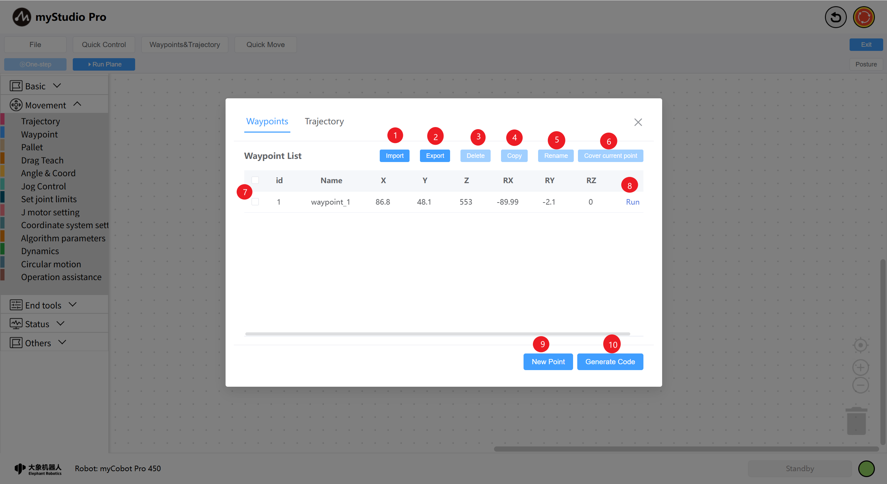

| Number | Description |
| ------ | -------------------------------------------------------- |
| 1 | Clicking the "Import" button imports a previously saved waypoint information JSON file.
| 2 | Clicking the "Export" button exports all waypoint information into a single JSON file.
| 3 | Clicking the "Delete" button deletes all selected waypoints in the current waypoint list. |
| 4 | Clicking the "Copy" button copies the coordinate information of all currently selected waypoints.
| 5 | Clicking the "Rename" button renames all currently selected waypoints.|
| 6 | Clicking the "Cover current point" button quickly overwrites the coordinate information of all selected waypoints with the current robot arm coordinates.|
| 7 | Selecting columns in the list data is a prerequisite for functions 3-6.|
| 8 | Clicking the "Run" button moves the robot arm to the currently recorded waypoint position.
| 9 | Clicking the "New Point" button records the current robot arm coordinates.|
| 10 | Clicking the "Generate Code" button quickly generates waypoint blocks in the Blockly program coding area.

Select a waypoint block in `myBlockly` and add it to the program coding area. Alternatively, use the `Generate Code` button in the waypoint list to add the generated waypoint block to the last block in the workspace.

The waypoint block associates data from the waypoint list. Select any waypoint in the list to associate.

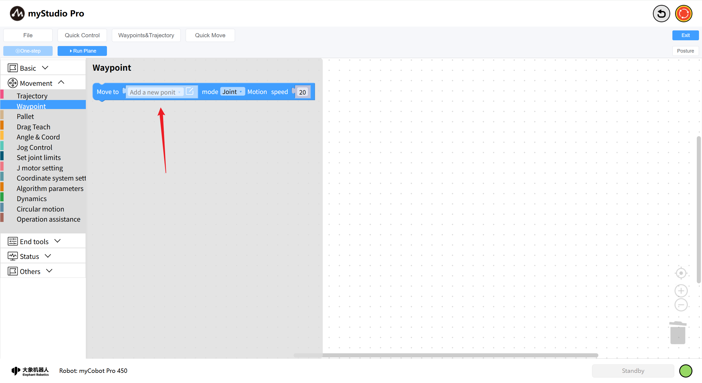

Adds point information to the waypoint block. Select "Add Waypoint," click the "Edit" icon to open the "Add Waypoint" pop-up. The default waypoint name will be displayed. Adjust the waypoint information using the "+" or "-" buttons, and then click the "Save Waypoint" button to add the waypoint data.

> Furthermore, the waypoint blocks can have their motion modes modified: Joint Motion Mode: moves based on the joint information of the current waypoint; Linear Motion Mode: moves based on the coordinate information of the current waypoint.

| Number | Description |
| ---- | ------------------------------------------------------------ |
| 1 | Select a waypoint. Clicking the edit icon will open the waypoint editing pop-up.|
| 2 | Enter the waypoint name.|
| 3 | Displays the joint and coordinate data of the robotic arm. Adjust the waypoint data using the left (-) and right (+) buttons.|
| 4 | Click "Save Waypoint" to add or modify waypoint data.|

## 11 Trajectory

Introduces how to use the track function to control the robotic arm and achieve drag-and-drop teaching.

Function Description: By recording multiple track data (robotic arm joints), quickly control the robotic arm to reach each track point position. Open the track list page, click the "Record trajectory" button, the joints of the robotic arm will relax, manually drag the robotic arm to record the track, click "Stop Recording" and wait for the track to be saved. Once saved, the track recording is complete. Successfully recorded tracks will automatically generate a track type file in the "draft" (For file function related operations, [please click here](./5.3.2-myBlockly.md#12-file-management)).

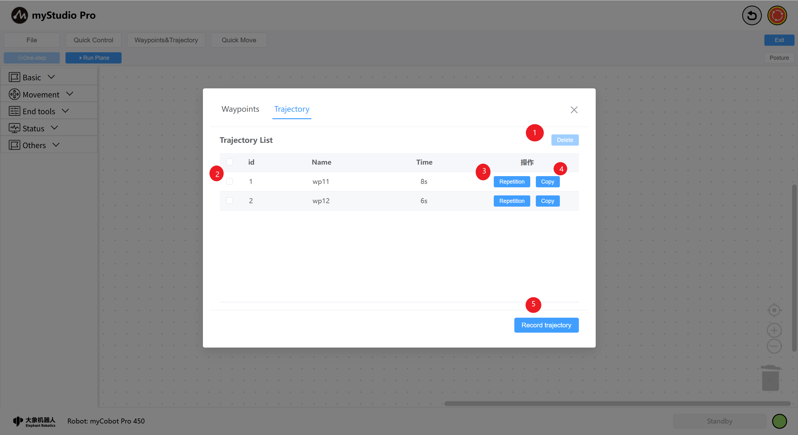

| Number | Description |
| ---- | ------------------------------------------------------------ |
| 1 | First, select the trajectory to be deleted. At least one data point must be checked for the button to be available. Clicking "Delete" will delete all checked trajectories.|
| 2 | Select columns in the list data. Function 1 requires this function.|
| 3 | Clicking the "Reprtition" button allows you to reproduce the trajectory.|
| 4 | Clicking the "Copy" button copies the current trajectory to the test file workspace.|
| 5 | Clicking the "Record trajectory" button will prompt the robotic arm to confirm the recording operation. After confirmation, recording will begin (maximum 60 seconds; recording will automatically stop after this time).|

Then, select the trajectory block in `myBlockly` and add it to the program programming area. Clicking the drop-down menu of a trajectory block in the workspace allows you to select data from the current trajectory list page.

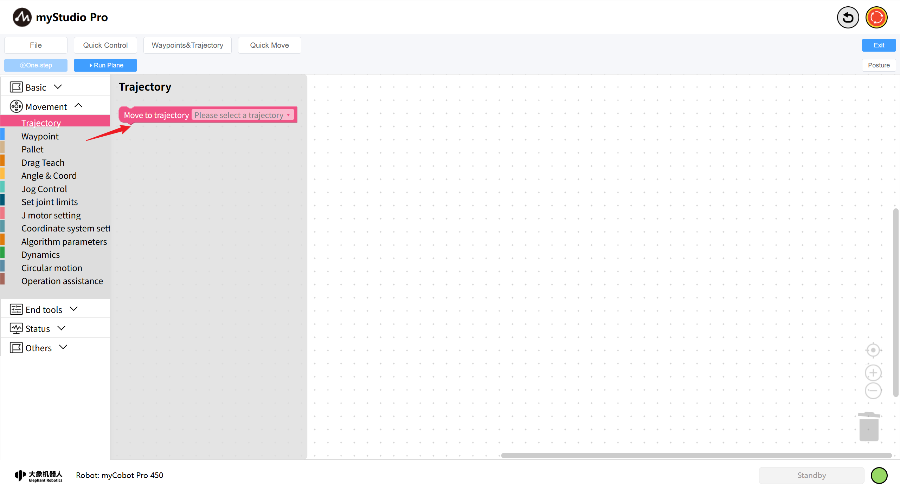

After selection, open the Run Plane and click Run All to reproduce the trajectory using the block-by-block method.

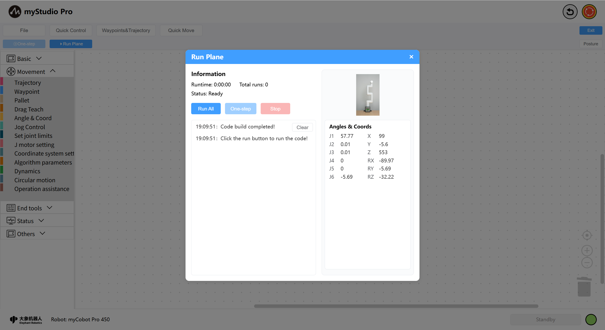

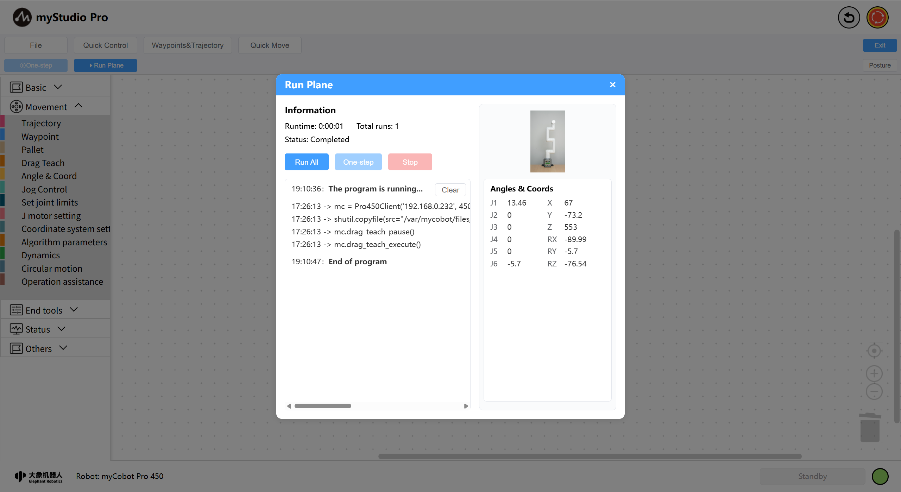

After the program runs, the trajectory is reproduced. Of course, you can also use other blocks for more complex programming.

## 12 File Management

Introduces how to use the file management module.

Function Description: The file management module allows for easy saving, importing, and exporting of files from different file spaces. There are two ways to open the file list: Open File from the Homepage - or Open from the file operation menu on the myBlockly page. This will open the file management list and load your saved file content, including workspaces, waypoints, and track files (for information on how to save workspaces, [click here](./5.3.2-myBlockly.md#2-basic-function-usage)).

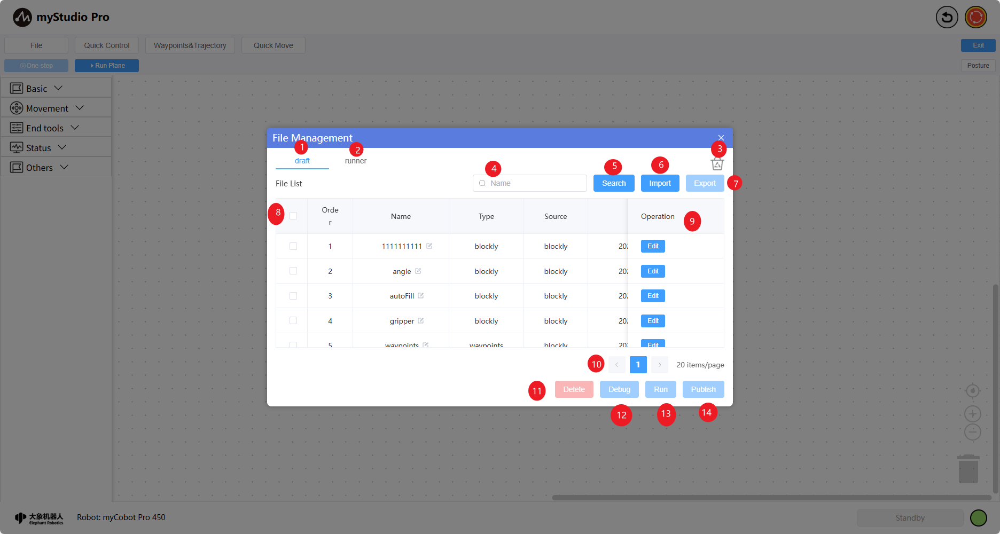

| Number | Description |
| ------ | ------------------------------------------------------ |
| 1 | draft: Switching to this option will paginate and display all test files. |
| 2 | runner: Switching to this option will paginate and display all production files. |
| 3 | Recycle Bin File Space: Switching to this option will paginate and display all recycle bin files (files deleted from the test/production space will go to the recycle bin and will be automatically reclaimed after `30` days). |
| 4 | Search condition input box. Currently, only fuzzy search by filename is supported. You can press Enter to search directly or click the function 5 button.|
| 5 | Search button. Clicking this button allows you to perform a paginated search based on the input box content.|
| 6 | Import button. Clicking this button allows you to import files from the current device.|
| 7 | Export button. Disabled by default, enabled when a single file is selected. Clicking this button allows you to export the selected file.|
| 8 | List data selection column. Functions 7 and 11-14 require this function.|
| 9 | Single file operation buttons, including the following function buttons: `Edit` - Loads the file content into the workspace; `Preview` - Only applicable to trajectory files; 3D models simulate trajectory points; `Copy` - Copies the production space file to the test space; `Recover` - Restores the recycle bin space file to the test space. |
| 10 | Pagination button: Enables pagination when the current file space exceeds the specified limit.|
 11 | Batch operation button: `Delete` - deletes selected files to the recycle bin.| 
 |12 | Single file operation button: Selecting a file and clicking this button loads the file's content into the workspace and automatically opens the debug panel.|
| 13 | Single file operation button: Selecting a file and clicking this button loads the file's content into the workspace and automatically opens the debug panel. The panel allows you to set the number of times the file will run – infinite loop or multiple loops.|
| 14 | Single file operation button: Selecting a file and clicking this button publishes the file to the production space.|

**Search**

By default, queries all files. You can enter a filename for a fuzzy search. When the input box contains content, the search will be based on the current file space and the content. A successful search will display a message.

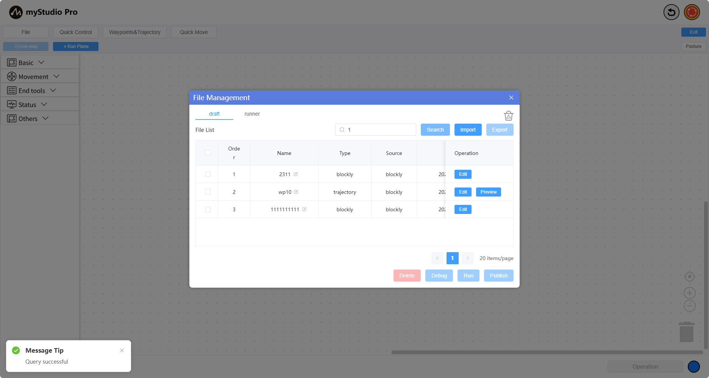

**Import**

Click the Import button, select the file to import, and click OK.

> Note: The file selected for import must be exported from myStudio Pro; otherwise, you will encounter an import failure or import success but "cannot be edited" error.

Click the Import button, select the file to import, and click OK.

**Edit**

Click the Edit button to load the file content into the workspace.

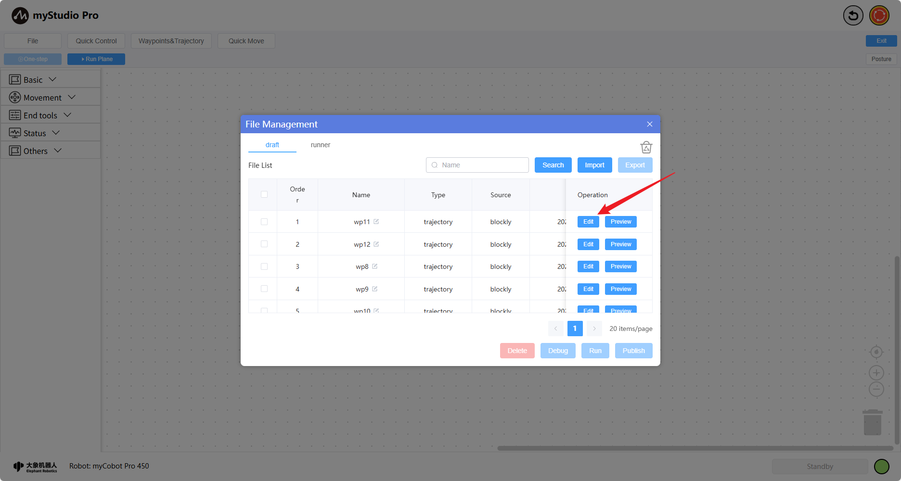

**Preview**

ClickThe `Preview` button will open the preview panel. The 3D model will simulate motion based on the actual points in the trajectory file.

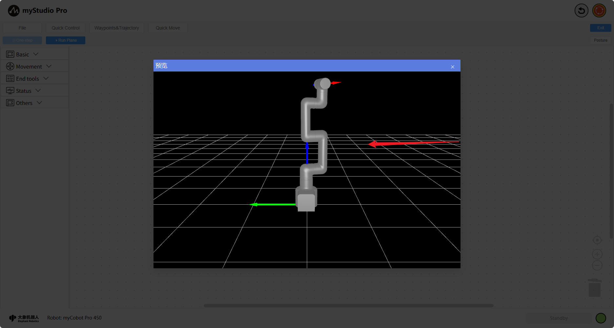

**Delete**

Click the `Delete` button to delete files in batches, moving the selected files to the Recycle Bin.

Select the files you want to delete, then click the `Delete` button. Switch to the Recycle Bin option to view the deleted files in the list.

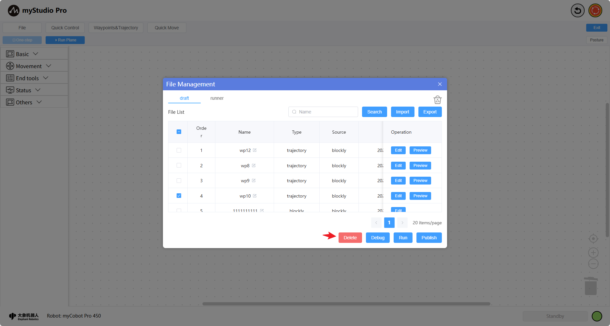

**Recover**

Click the `Recover` button to restore the file from the recycle bin to the test space.

**Debug**

Select the files you want to debug, then click the `Debug` button. It will first check if there is any unsaved content in the workspace and prompt you. If so, a pop-up window will appear; click "Ok" to load it into the workspace. Otherwise, it will load directly and open the debug panel.

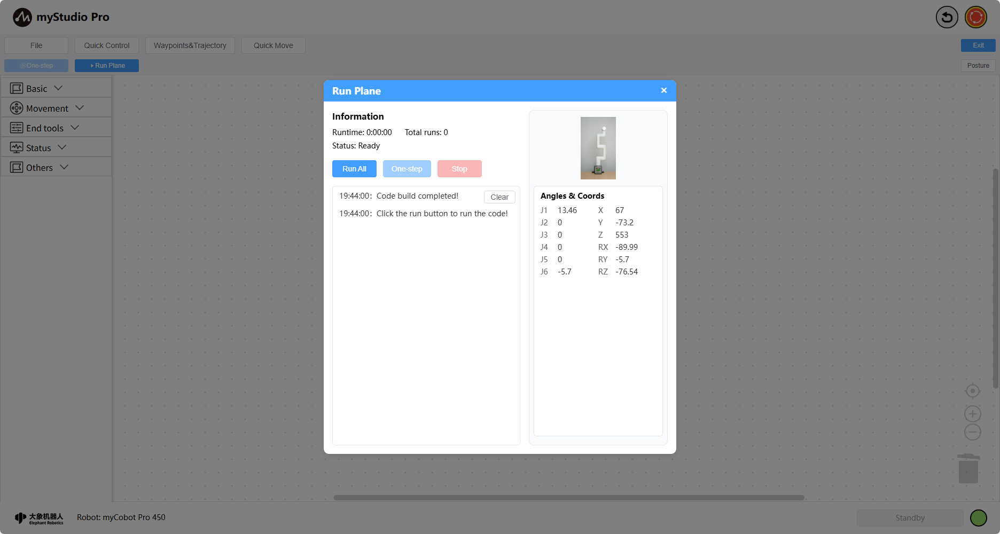

Click "Run All" to begin debugging.

**Run**

Select the file you want to run, then click the `Run` button. First, it will check if there is any unsaved content in the workspace and prompt you. If so, a pop-up window will appear; click "Ok" to load it into the workspace. Otherwise, it will load directly, and the Run panel will open; click "Run" to run the file.

You can choose to run the file infinitely or specify the number of runs (the following explains the looping process). After setting, it will run in a loop. First, it will prompt you twice for confirmation; click "Confirm" to start the loop.

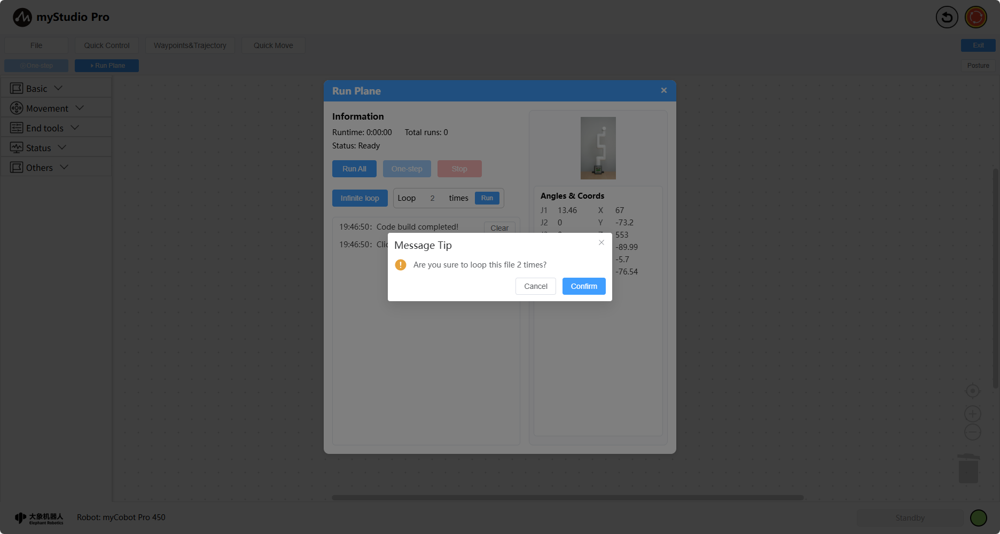

After running.

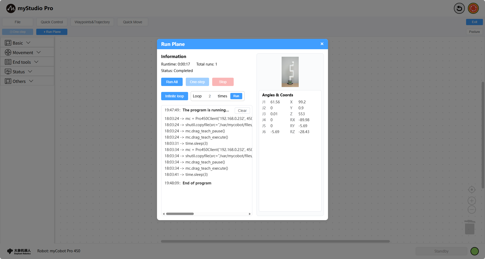

**Publish**

Select the files to be published, and then click the `Publish` button. This will publish the corresponding files from the test space to the production space.

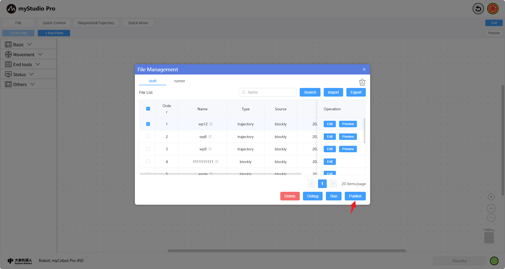

**Copy**

Click the `Copy` button to copy the file from the production space to the test space.

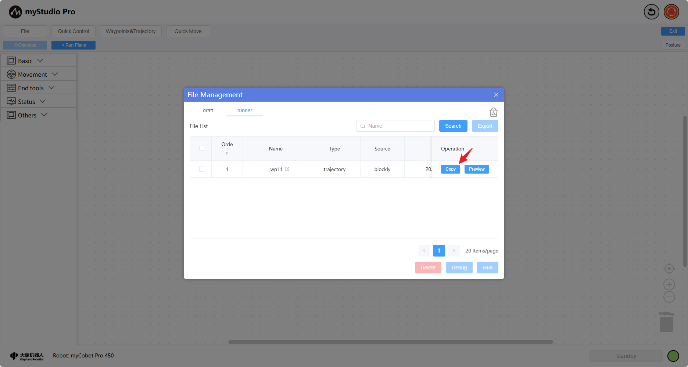

[← Previous Chapter](./5.3.1-myStudioFirstUse.md) | [Next Chapter →](./5.3.3-quickmove.md)