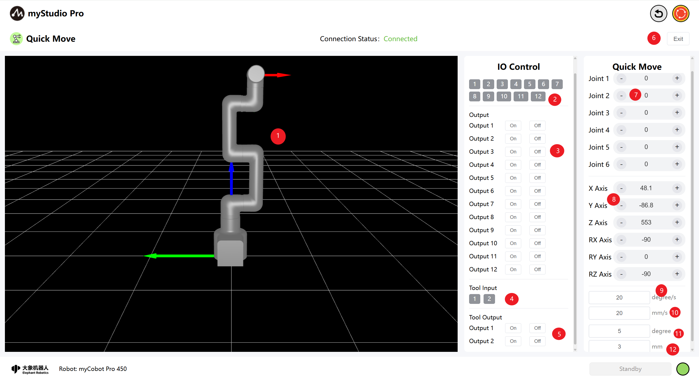
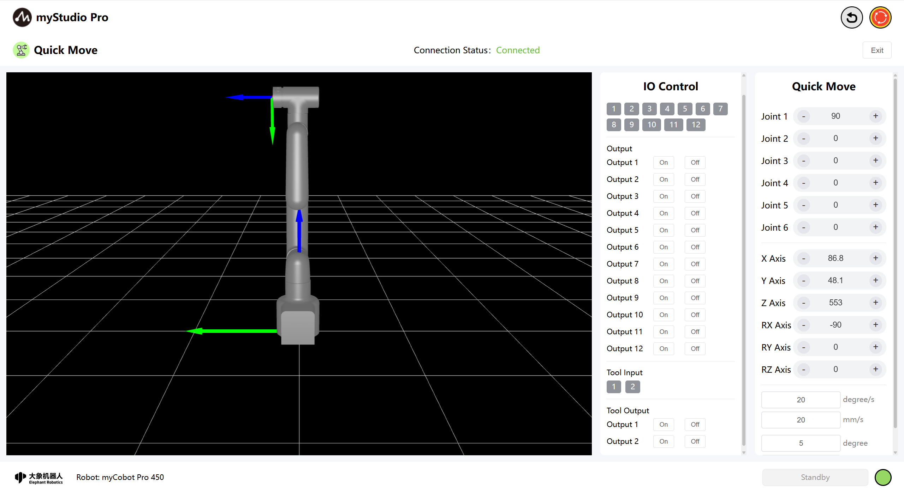
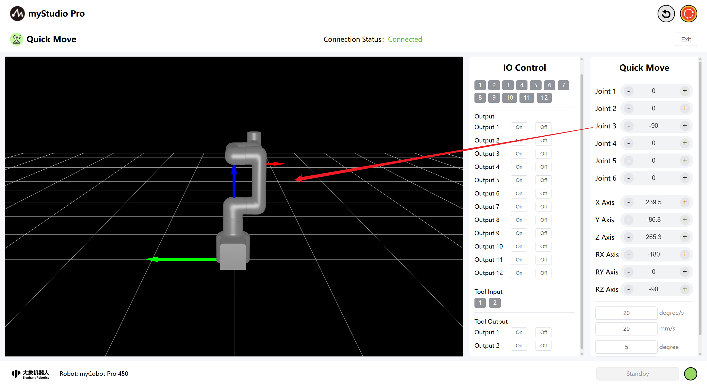
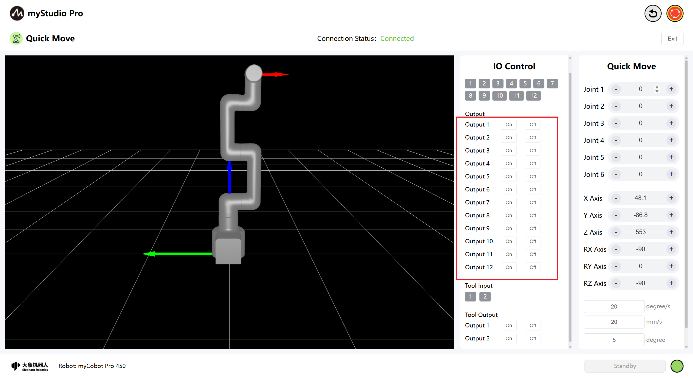
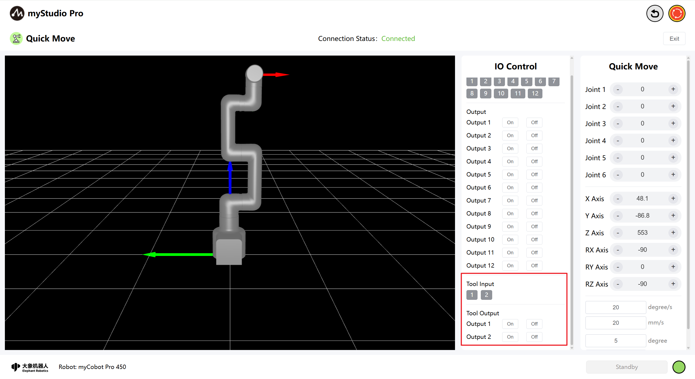
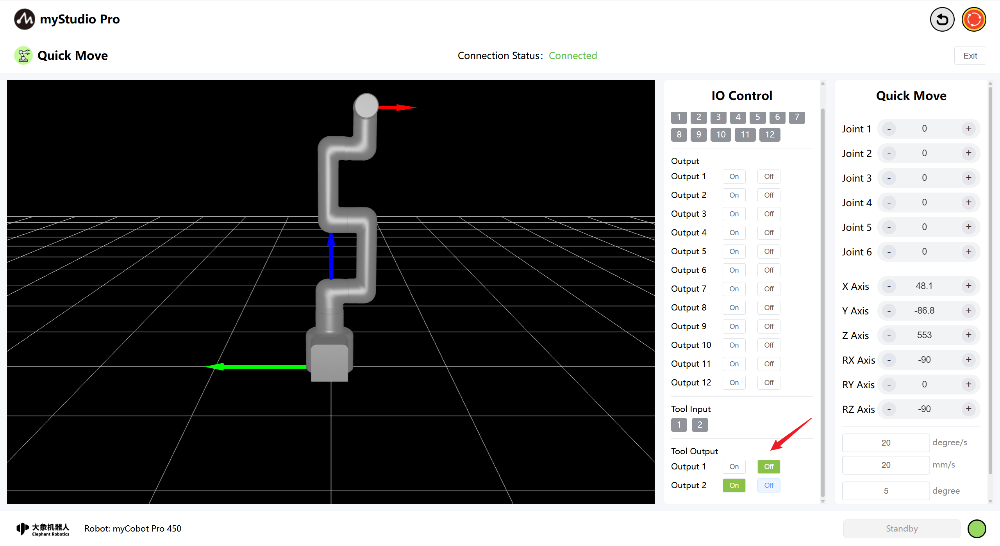
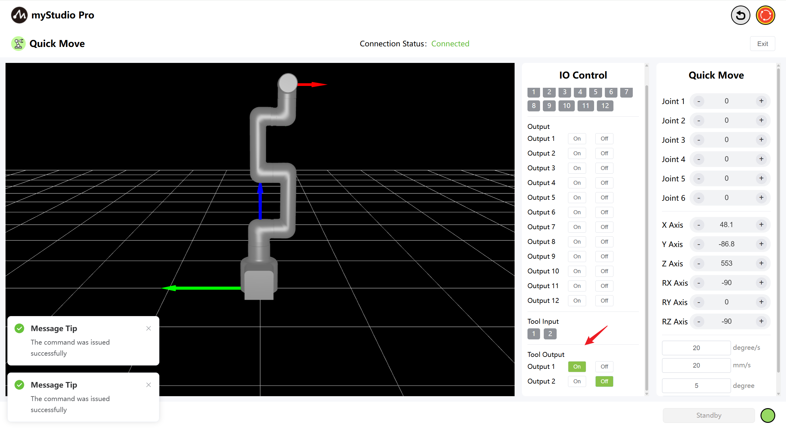

# Quick Move

*Before Starting*

> *1. Ensure the machine is powered on*

> *2. Ensure the machine connection and communication are normal*

> *3. Ensure the machine is in zero position*

> *4. The machine server is running*

## 1 Interface Introduction

| Number | **Description** |
| ---- | ------------------------------------------------------------ |
| 1 | myCobot Pro 450 3D Simulation Model (Coordinate system: Red arrow: X, Green arrow: Y, Blue arrow: Z) |
| 2 | Bottom IO pins 1-12, Input, belongs to the safety module detection item |
| 3 | Bottom IO pins 1-12, Output, the output can be set by clicking the switch button |
| 4 | End-effector I/O pins 1 and 2, inputs |
| 5 | End-effector I/O pins 1 and 2, outputs, can be used to control the F100 force control gripper |
| 6 | Exit the quick movement interface |
| 7 | Angle control: By clicking the `+` `-` buttons, the joint angle of the robotic arm is controlled. The value represents the current joint angle information of the robotic arm. The value can also be directly modified for joint control. |
| 8 | Coordinate control: By clicking the `+` `-` buttons, the coordinate control of the robotic arm is performed. The value represents the current coordinate posture information of the robotic arm. The value can also be directly modified for coordinate control. |
| 9 | Set the movement speed of the robotic arm joints, default 20 degrees/s |
| 10 | Set the movement speed of the robotic arm coordinates, default 20 mm/s |
| 11 | Angle step size: The angle value that increases or decreases each time the angle is adjusted |
| 12 | Coordinate step size: The coordinate value that increases or decreases each time the coordinate posture is adjusted |

## 2 Angle Control
In the angle control area, by clicking the `+` The `-` button controls the joint angles of the robotic arm. The value represents the current joint angle information of the robotic arm, and you can also directly modify the value to control the joints, Enter the position within the limit range and then click `Enter` to start the control.

## 3 Coordinate Control 

Before using coordinate control, joint 3 needs to be moved to an angle of approximately -90 degrees.

In the coordinate control area, click the `+` and `-` buttons to control the coordinates of the robotic arm. The value represents the current coordinate posture information of the robotic arm, and you can also directly modify the value to control the coordinates, Enter the position within the limit range and then click 'Enter' to start the control.

## 4 Continuous Movement

By long-pressing the `+` and `-` buttons in the corresponding areas, you can control the robot to move continuously at a specified angle/coordinate.

Note: After each 3-second long press of the + and - buttons, you need to release the buttons, press and hold them again, and then continue the continuous movement.

Note: When controlling the coordinates, the robotic arm must first be moved to the coordinate control posture.

## 5 IO Control

### 5.1 Bottom IO

Set the bottom IO pin numbers 1-12 for output; users can customize the control actuators. For example, you can customize the control of the gripper and suction pump.

Click the `On` and `Off` buttons to configure.

### 5.2 End-of-Line I/O

Setting the end-of-line I/O pin numbers 1-2 allows you to control the F100 force-controlled gripper.

Turn on the F100 force-controlled gripper by clicking the `Off` and `On` buttons.

Disable the F100 force Control Gripper  by clicking the `On` and `Off` buttons.

[← Previous Chapter](./5.3.2-myBlockly.md) | [Next Chapter →](./5.3.4-resource.md)