# Settings

## 1 Interface Introduction

<table>
  <colgroup>
    <col style="width: 80px;" />
    <col />
  </colgroup>
  <thead>
    <tr>
      <th>Number</th>
      <th>Function Introduction</th>
    </tr>
  </thead>
  <tbody>
    <tr>
      <td>1</td>
      <td>General Settings Module, mainly for setting the language</td>
    </tr>
    <tr>
      <td>2</td>
      <td>Limit Settings Module</td>
    </tr>
    <tr>
      <td>3</td>
      <td>Check for Updates Module</td>
    </tr>
    <tr>
      <td>4</td>
      <td>Initial Posture Module</td>
    </tr>
    <tr>
      <td>5</td>
      <td>Test Module</td>
    </tr>
    <tr>
      <td>6</td>
      <td>Network Configuration Module</td>
    </tr>
    <tr>
      <td>7</td>
      <td>Account Settings Module</td>
    </tr>
    <tr>
      <td>8</td>
      <td>Module Content Display Area</td>
    </tr>
    <tr>
      <td>9</td>
      <td>Exit Settings</td>
    </tr>
  </tbody>
</table>

## 2 General Setting

Clicking the `General Setting` icon button will take you to the language settings page. Language selection supports `Chinese` and `English`.

After selecting the corresponding language, click the `Save` button. A confirmation pop-up will appear; click Confirm to successfully set the language.

## 3 Limit Setting

> Note: Limit parameter modification only supports the minimum and maximum angles of the joint; other parameters cannot be modified.

Clicking the `Limit Setting` icon button will take you to the joint limit settings page. The `Limit Setting` interface displays the joint and coordinate limit parameters of the current robotic arm by default.

The `Parameter lock` button is locked by default, and its blue color indicates that the limit parameters cannot be modified.

When the parameter is locked, clicking the `Parameter lock` button will turn it gray, indicating that the limit parameters can be modified (only the minimum and maximum angle values ​​can be changed).

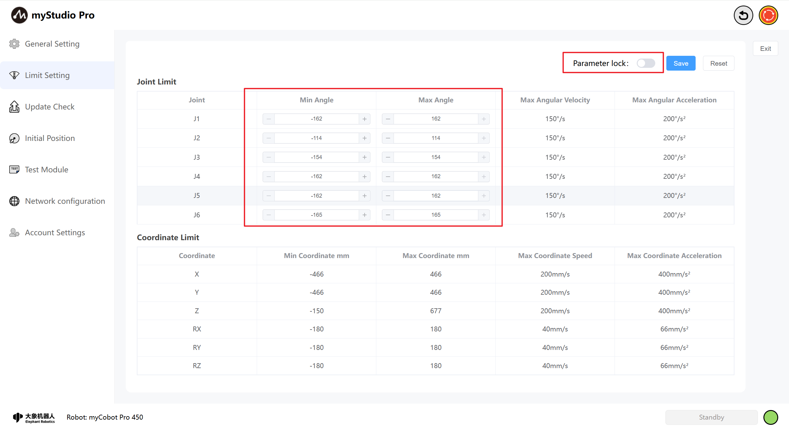

Click the `Save` button, and define the filename according to the prompts in the pop-up window. This will save the parameters of the current limit setting page to a local file (JSON file), and set the joint limits of the robotic arm. A message will be displayed on the page after successful setting.

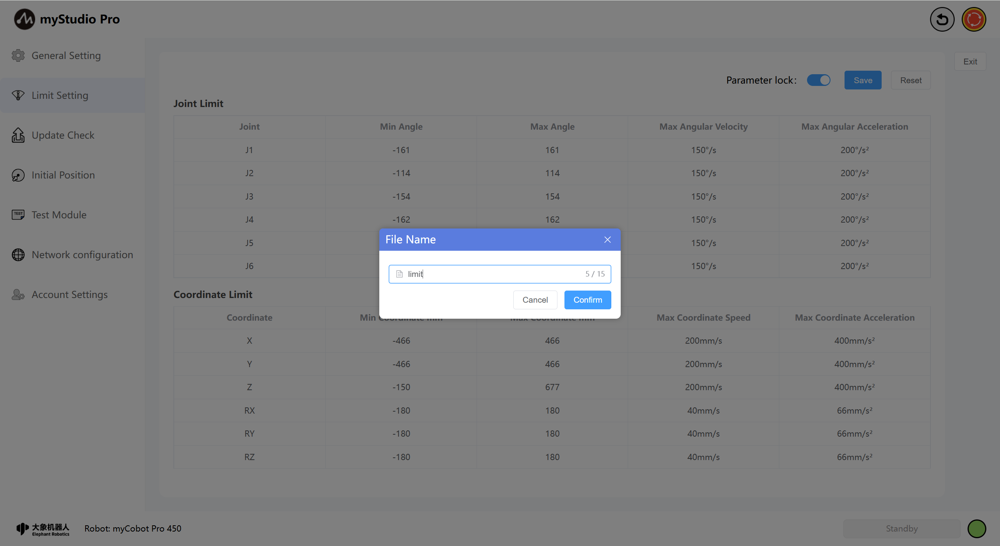

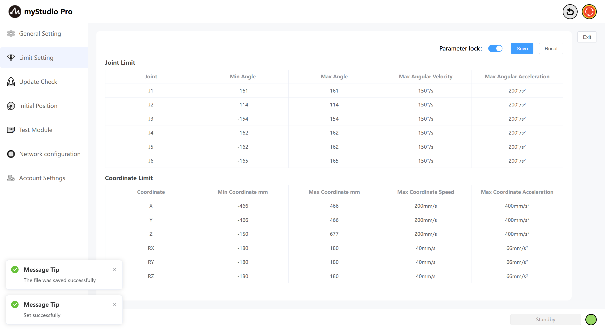

Click the "Reset" button to restore all joints and coordinate limits to their default Settings. When clicked, it prompts "Whether to restore the default Settings?"

When you click "Confirm", a prompt will appear saying "Set successful"

## 4 Update Check

Clicking the `Update Check` icon button will take you to the update status page.

The update page primarily checks the status of the robotic arm's end effector firmware, main control firmware, and myStudio Pro version.

If the corresponding firmware or software for the robotic arm is not the latest version, an update message will be displayed, and the status item will highlight "Update Required." Clicking this will initiate the corresponding update process.

Additionally, this page also provides a system image Upgrade button. This item displays the current version; clicking it will trigger a pop-up window with detailed upgrade instructions.

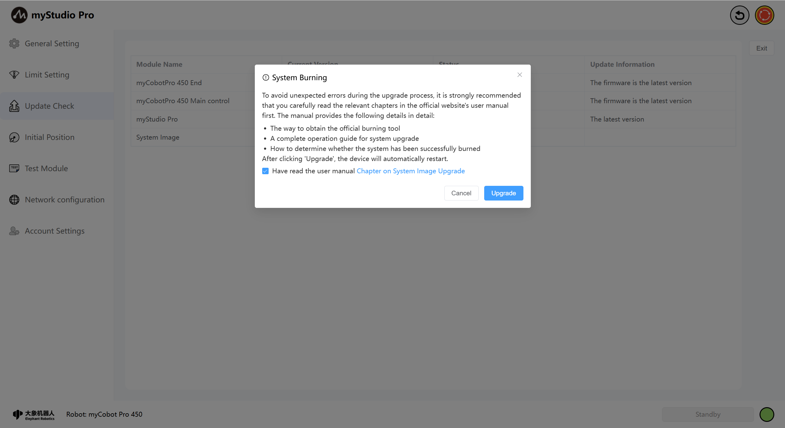

## 5 Initial Position

Clicking the `Initial Position` icon will take you to the Initial Pose page. This page contains `Initial Position` and `Packaging Position` content. You can switch between the content you want to access using the toggle button.

Initial Pose Page: Displays the robot arm's initial pose model, joint angle information, and coordinate pose information.

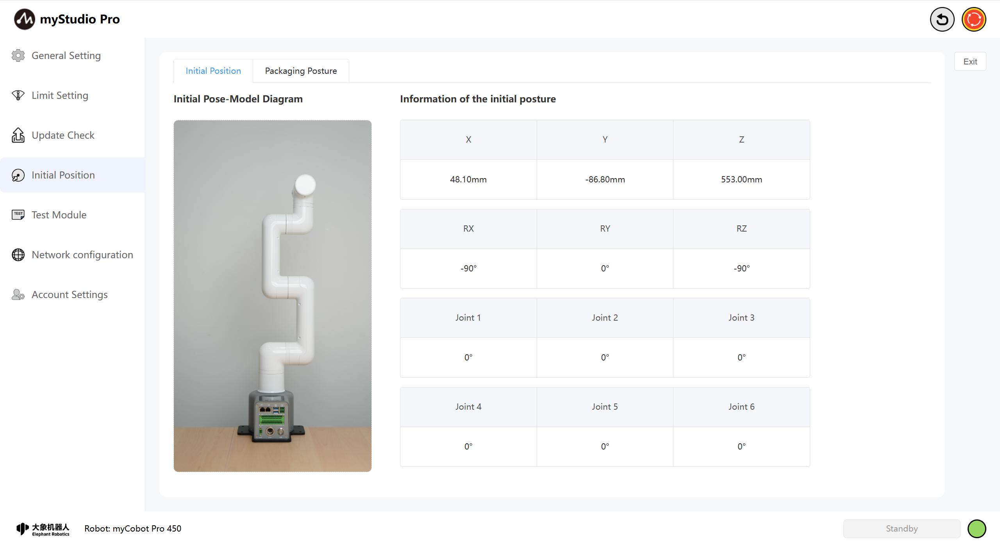

Packaging Pose Page: Displays the robot arm's packaging pose model, joint angle information, and the packaging button. This button is a function button; clicking it will move the robot arm to the packaging pose.

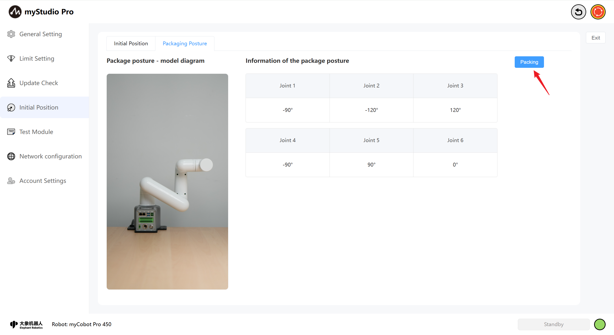

## 6 Test Module

Clicking the `Test Module` icon will take you to the test page.

The `Test` page primarily tests the robotic arm's communication connection, firmware version, servo motor status, etc.

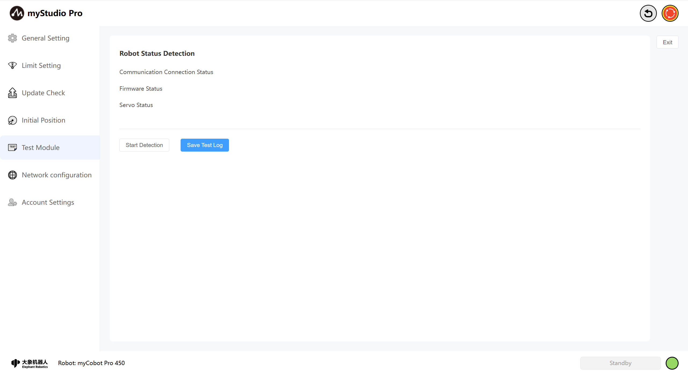

Clicking the `Start Detection` button will begin the test.

After the test is complete, click the `Save Test Log` button. Following the pop-up prompts, the test results will be saved to a local log file.

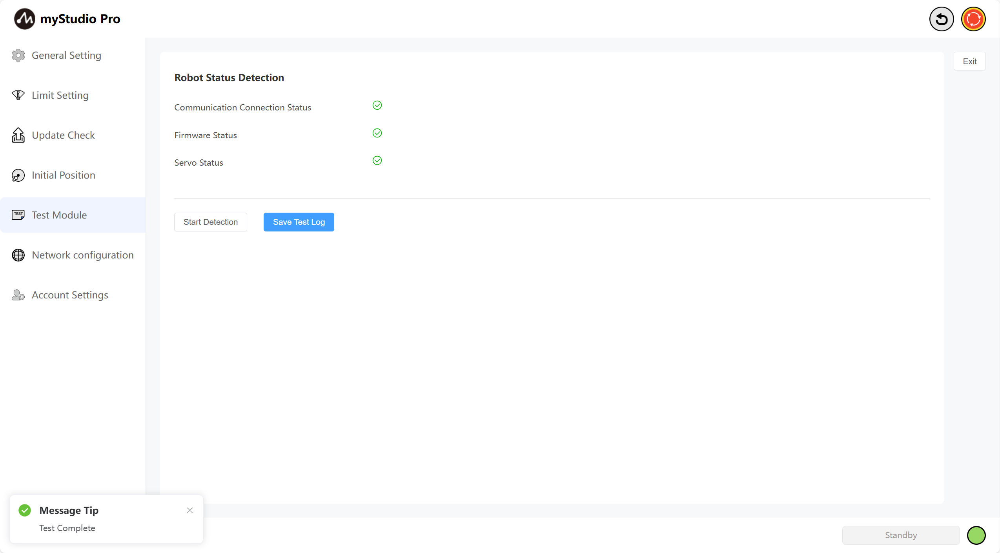

## 7 Network Configuration

Clicking the `Network Configuration` icon will take you to the network configuration page. This page primarily displays the robotic arm's network port information, including LAN1, LAN2, and WLAN.

> Note: The page content is displayed in real-time; network port information is only shown when a port is in use.

Simultaneously, you can connect to WiFi on this page. Enter the WiFi username and password you want to connect to and click the `Connect WiFi` button to connect.

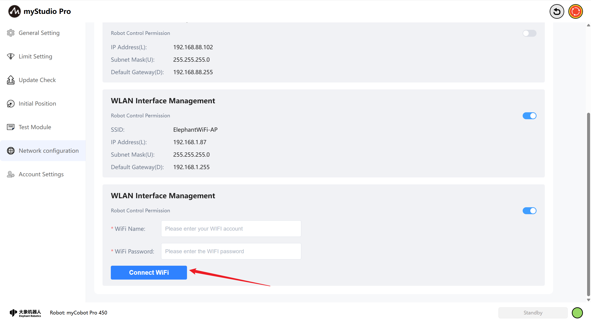

Furthermore, you can modify the robot control permissions for this network port on this page. If robot control permissions are not enabled, accessing myStudio Pro will display "No control permissions." MyStudio Pro can only be used normally when control permissions are enabled.

**The following explanation is based on the WLAN port.** The control logic for the LAN2 port is the same.

In your browser, enter the IP address of the WLAN port to access MyStudio Pro (Wi-Fi connected & control permissions not enabled).

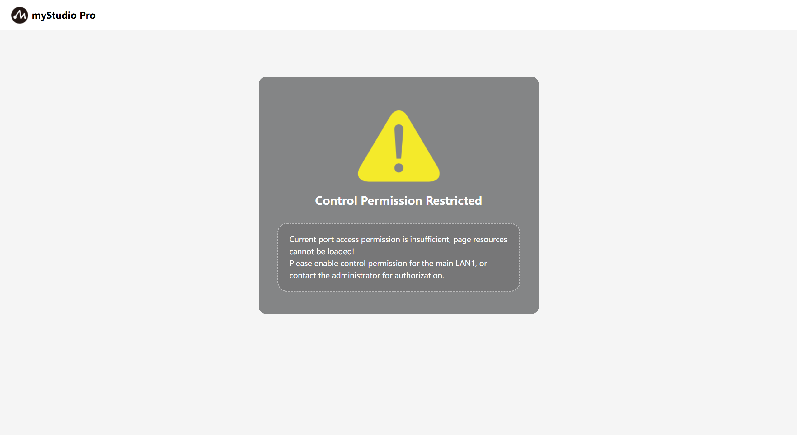

When `enabling`/`disabling` control permissions, a second confirmation is required. Clicking Confirm will successfully enable/disable control permissions.

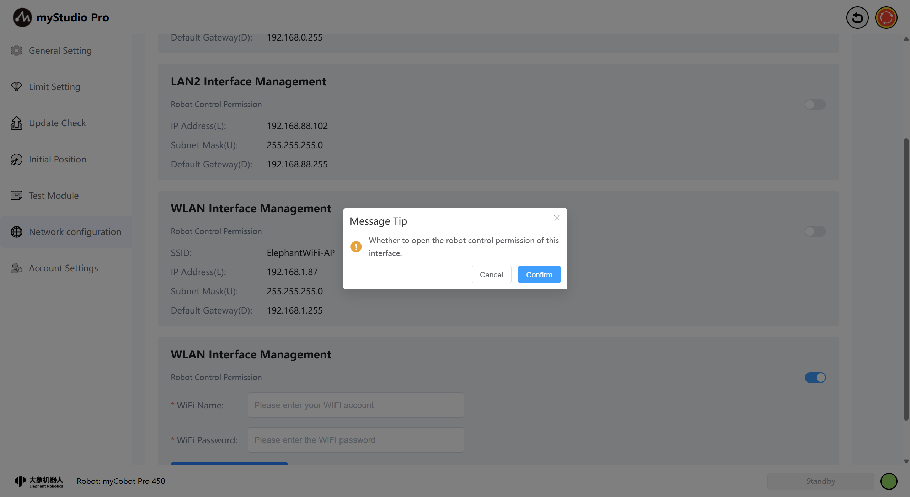

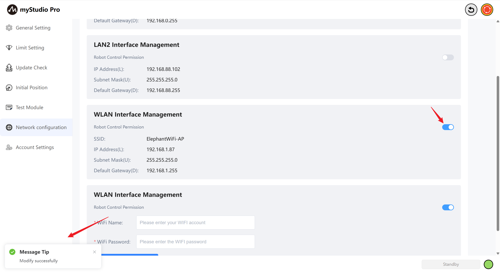

In your browser, enter the IP address of your WLAN port to access myStudio Pro (Wi-Fi connected & control permissions enabled). You will be taken to the account login page. Enter the correct username and password to use myStudio Pro. The default username and password are `admin` and `123`. If you have changed your username and password ([see point 8 for instructions](./5.3.5-setting.md#8-account-settings)), please use the changed username and password to log in; otherwise, you will not be able to use myStudio Pro.

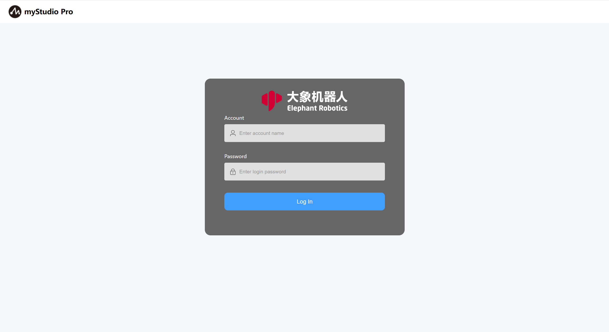

After successful login, the system will first check if any network port is currently using myStudio Pro. If so, a second login confirmation will be required. Clicking "Login" will automatically log the currently used network port offline, allowing you to use myStudio Pro normally. Clicking "Cancel Login" will return you to the login page. Otherwise, you will directly enter the myStudio Pro main interface.

## 8 Account Settings

Clicking the `Account Settings` icon will take you to the account settings page. This page is mainly used to set the username and password for logging into myStudio Pro using the LAN2 or WLAN network port. If the username and password are saved successfully, they will be used to log in to myStudio Pro the next time; otherwise, you will not be able to use myStudio Pro normally.

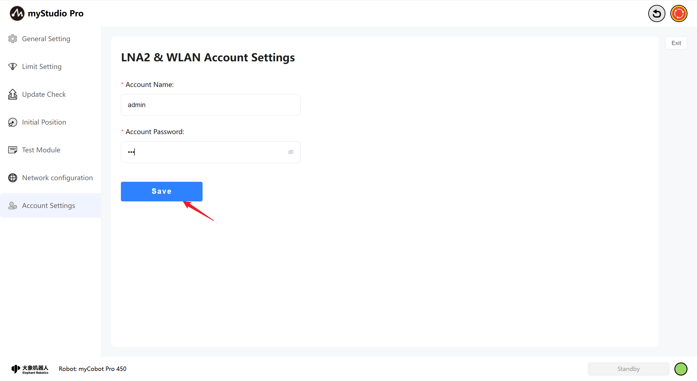

[← Previous Chapter](./5.3.4-resource.md) | [Next Chapter →](./5.3.6-modbus.md)