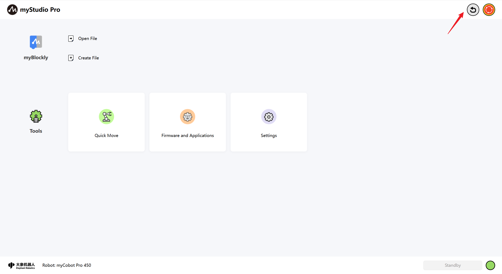
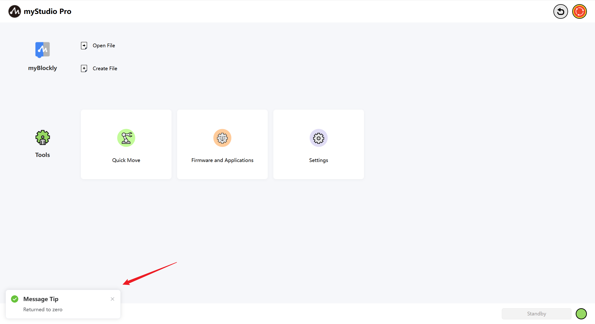
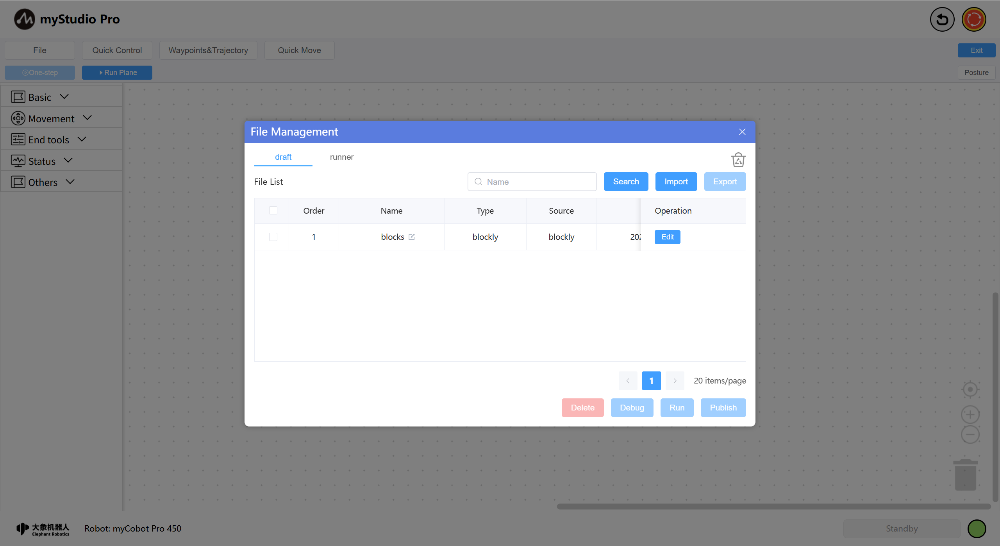
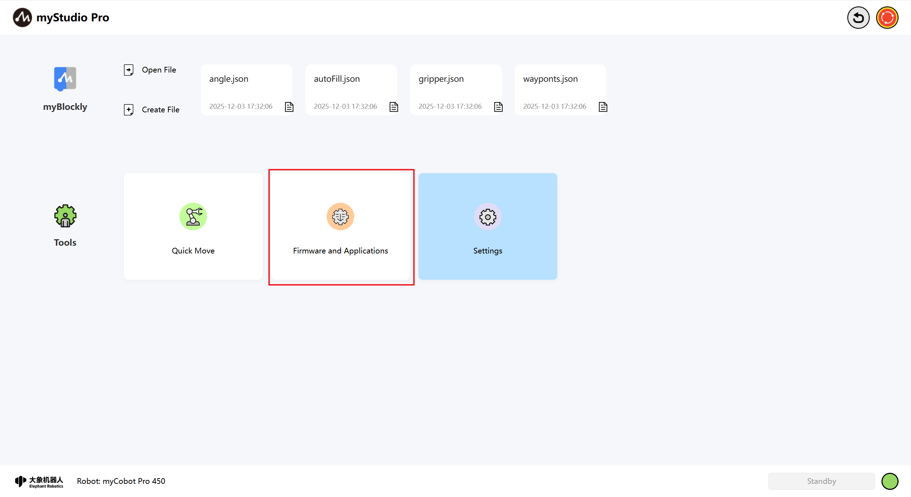
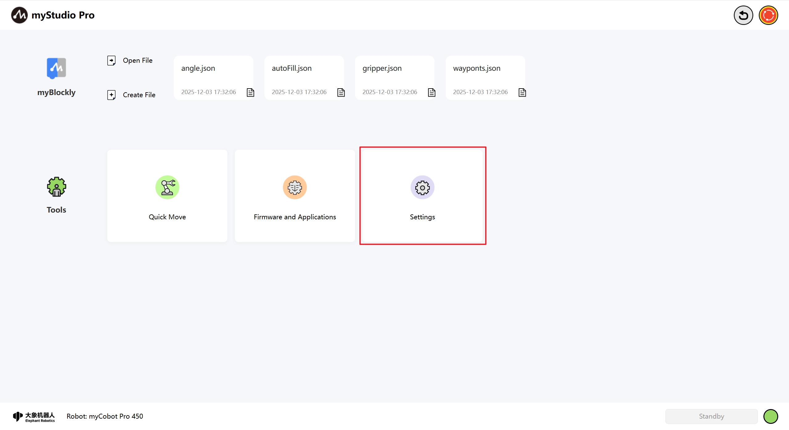
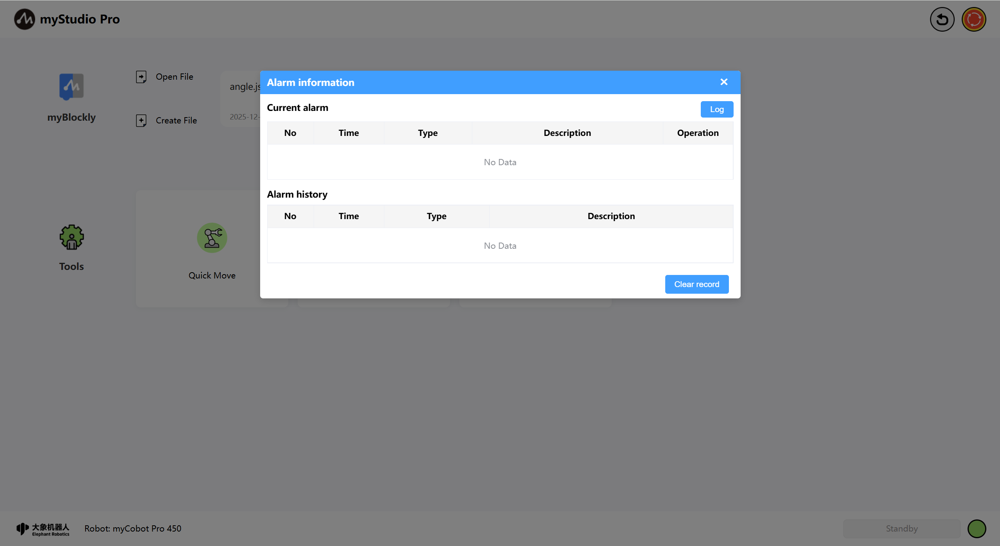

# What is myStudio Pro?

**myStudio Pro** is a robot programming and control software integrating multiple functions, providing users with one-stop solutions such as visual programming interaction, quick movement control, drag teaching, robot status query and configuration. The software mainly integrates four functional modules: `myBlockly`, `Quick Move`, `Firmware and Applications`, and `Settings`, covering the entire process requirements from programming to debugging, from learning to deployment.

The **`myBlockly`** module draws on Scratch, a children's programming language developed by the Massachusetts Institute of Technology, in terms of functionality and design concept, and uses a graphical building block assembly method for programming. Users can gradually build a complete code logic by intuitively dragging and dropping module combinations. The entire process is simple to operate and easy to understand, making it especially suitable for programming beginners and teaching scenarios.

From the perspective of user experience, **myBlockly** is a low-threshold visual code generation tool that makes programming as easy and intuitive as building with blocks. From the perspective of developers, this module is essentially a text editor capable of dynamically generating structured code. The code generated by users through drag-and-drop interactions will eventually be transformed into a sequence of instructions that can be executed on robots. This design and interaction method not only reduce the difficulty of use but also ensure the professionalism and executability of the program.

**Quick Move**

The module focuses on the rapid positioning and real-time control of the robotic arm. The rapid movement function can quickly move the robotic arm to the designated position. The read and write states of the end and bottom IO can be set. In addition, the module provides a dedicated operation area, supporting step-by-step or continuous motion control of joints or coordinates, achieving high-precision position adjustment and flexible motion debugging.

**Firmware and Applications**

The module provides users with a convenient resource navigation function, centrally displaying the entry points of commonly used external links, including firmware downloads, technical documents, official contact information, etc. Users can quickly access relevant supporting materials without manually searching, improving the efficiency of use and maintenance.

**Settings**

The module covers the basic configuration options of software and robot systems. Users can perform operations such as language switching, joint movement limit setting, system update detection and update here.

# myStudio Pro interface display and the use of basic functions

Open the software. The main interface is as shown in the following figure.

Interface function introduction: The interface is divided into three areas:

1. Reset to zero and power on/off
2. Function realization
3. Information display

Note: The software will automatically communicate and connect to the machine. If the lower right corner shows "Not connected", please check whether the network connection between the PC and the machine is unobstructed, or try restarting the machine.

## Return to zero

The function of this button is to control all the joints of the robot to return to the zero position.

**Note :**  The function of this button takes effect only if the communication of the robot has been successfully connected. After long pressing and clicking this button with the left mouse button, the robot will start to execute the return-to-zero command. The mechanical arm will slowly move to the zero position. Once the mouse button is released after long pressing, the return-to-zero command stops executing.

After the zeroing process is completed, a pop-up window will appear to prompt that the zeroing is done.

## Soft emergency stop

The function of this button is to control the power failure of the entire robot. When visiting the page, it will detect whether the current robot is powered on. If it is powered on, this button will be in red. If the robot is not powered on, this button will change to green and a pop-up window will appear to indicate that the robot is not powered on. You can click this button to power it on.

## Power on

When this button is in a green pattern, its function is to power on. After left-clicking this button with the mouse, the robot will start to execute the power-on command. The entire interface of the application will be covered with a layer of transparent light gray shadow. Before the power-on is completed, do not click on other functions within the interface, and a rotating pattern indicating that the application is power-on will be displayed at the center of the application.

After power-on is completed, the icon will turn red and a pop-up window will appear to prompt.

## Power off

When this button is marked in red, its function is to power off. After left-clicking this button with the mouse, the robot begins to execute the power-off command.

After the power-off is completed, the icon will turn green and a pop-up window will appear as a prompt.

## Function implementation

Here you can choose the functions you want to use. The functions include the following:

1. [myBlockly Graphical Programming](./5.3.2-myBlockly.md)
2. Move quickly
3. Firmware and Applications
4. Settings

## myBlockly
`myBlockly` is a fully visual modular programming interface, belonging to a graphical programming language, suitable for beginners to get familiar with programming. Users can develop applications by dragging and dropping puzzles to create both simple and complex functions. Supports functions such as saving, loading, single-step debugging and execution of graphical code, and executing specified individual building blocks.

Note: To use myBlockly, you must first connect the device for communication.

#### myBlockly

Here is a clickable button. Clicking it with the left mouse button will redirect you to [myBlockly Graphical Programming Interface](./5.3.2-myBlockly.md).

#### Open File

Here is a clickable button.

After clicking, it will automatically redirect to myBlockly and open the file management list, allowing you to perform operations related to JSON files based on the file list.

#### Create File

This button has the same function as [**myBlockly**](./README.md#myblockly).

**quickly load the historically saved blockly file**

When you have used myBlockly programming and have already saved blockly files, the names of the saved files and their saving times will be displayed at the position shown in the following figure. The maximum number of displayed files is 4. If it exceeds 4, only the latest 4 saved files will be shown. Left-click the mouse button to open myBlockly and automatically load the selected blockly file.

## Common tools

#### [Quick move](./5.3.3-quickmove.md)

Function: Provide quick control of robot IO as well as quick control of joint angles and coordinates

#### [Firmware and Applications](./5.3.4-resource.md)

Functions: Provide updates and upgrades for the embedded firmware of robots, product user manuals, official videos, official GitHub online stores, and feedback functions.

#### [Settings](./5.3.5-setting.md)

Functions: Integrates the following core functions: real-time monitoring of robot status and information, one-click check and update of application versions, personalized Settings (language/motion parameters), as well as quick configuration of network connections and login accounts, helping you manage the robot system efficiently.

## Information display

The underlying part of the application includes the logo of Elephant Robot Company, the current type of machine, alarm prompts, and the current operating status of the robot.

## Alarm prompt

Function: Display robot error messages, and left-clicking with the mouse can open the error log window.

Left-click the mouse button to open the error log window.

If the robot reports an error during operation, the application will capture the exception and display it in the error log interface. The meaning in the error log table is as follows:

- No: Error log serial number
- Time: The time when the error occurred
- Type: The type of error that occurs
- Description: Incorrect description information

After the application captures an error, it will first pop up a window to prompt and provide a solution. If you don't want to deal with the error, you can also ignore it. When you disconnect and reconnect the device or enter the error log interface and click the "Clear" button, a pop-up window will appear again to prompt you and save it to the error log table.

## Robot status

Function: Display the current operating status of the robot

| Color | meaning                                                     |
| ---- | ------------------------------------------------------------ |
|  |  not connected |
|  | standby  |
|  |  operation |
|  |  error |

---

[← Previous Chapter](../5.4-minirobot/README.md) | [Next Chapter →](./5.3.1-myStudioFirstUse.md)