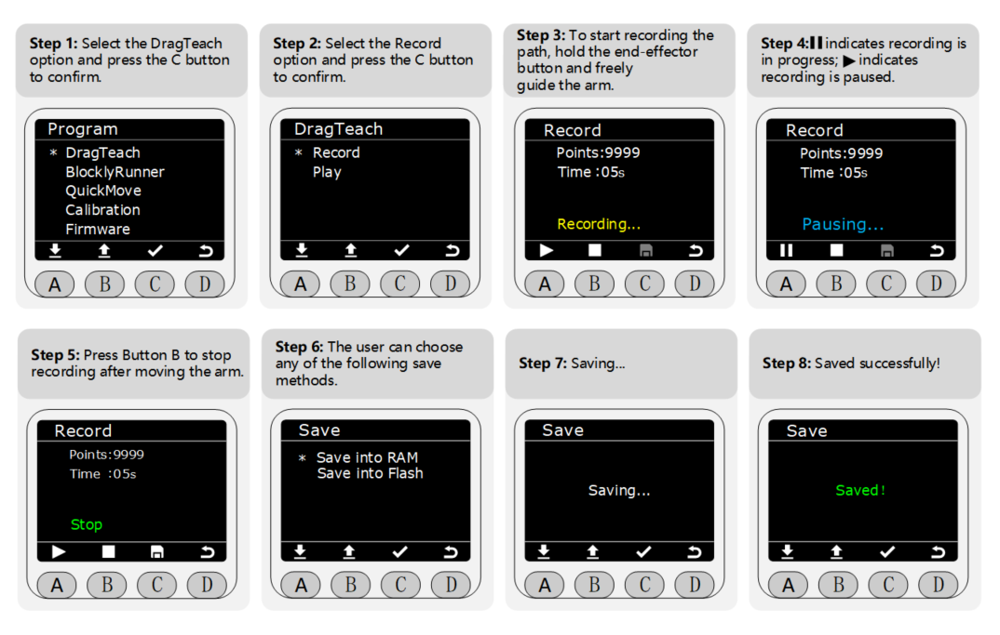
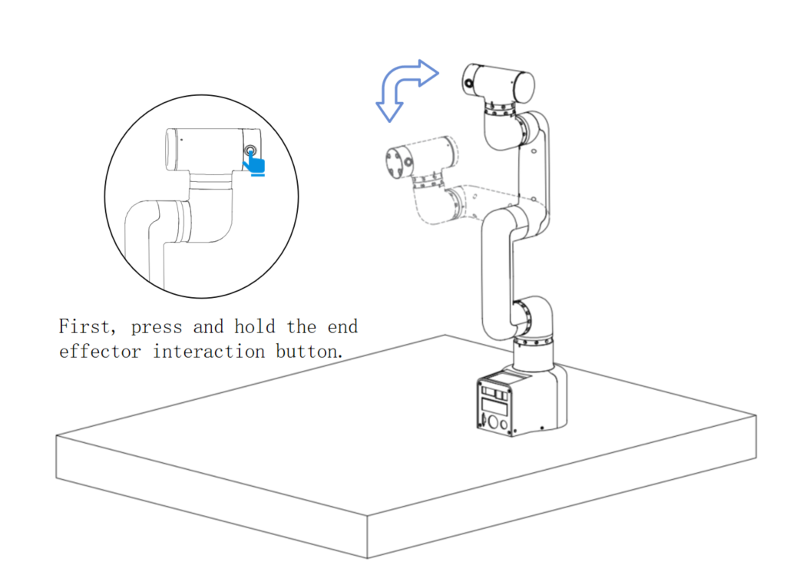

# Startup Troubleshooting Guide

## 1. Self-check upon first use.

>> **Note:** After unpacking, please place the robotic arm horizontally on a table that can support at least three times the weight of the robotic arm. The correct posture of the robotic arm is as follows:

## 2. Structural installation and fastening

During the movement of the robotic arm, if the **base of the myCobot is not connected to the tabletop or other supporting surface**, it can still cause the myCobot to **shake or tip over**.

1. Before beginning assembly, please clean your workspace and prepare the necessary tools.

  Working environment: Place the robot arm on a level surface with a load capacity at least three times greater than the weight of the robot arm itself, and ensure there is sufficient space for installation, operation, maintenance, and repair within the robot arm's working range.
  Tool list: mycobot pro 450 robot arm main body, product accessories package, product user guide, etc.

2. Place the robotic arm flat on the table and position it facing the edge of the table, then secure it with a G-clamp. 

**3. The robotic arm is shipped to the user with the base plate already installed. If the user needs to disassemble or replace the base plate, please refer to the following video for instructions:**

<video width="800" controls>
  <source src="https://download.elephantrobotics.com/software/MyCobot%20Pro%20450/myCobot%20Pro%20450%20Base%20Plate%20Installation.mp4" type="video/mp4">
</video>

> **Note:** myCobot base screw hole connections

> The robot must be securely mounted on a sturdy base for proper operation.  The base can be either a fixed or mobile type.

> Please ensure that the mounting base has corresponding threaded holes before proceeding with the installation.

> Before proceeding with the installation, please confirm the following:

> * The installation environment must meet the requirements specified in the "Working Environment and Conditions" table above.
> * The installation location must be no smaller than the robot's working range, and there must be sufficient space for installation, operation, maintenance, and repair.
> * Place the machine base in the appropriate position.
> * The necessary installation tools, such as screws and wrenches, are ready.
> **After confirming the above information**, please move the robot to the mounting platform on the base, adjust the robot's position, and align the mounting holes on the robot base with the holes on the mounting platform.  Once the holes are aligned, insert the screws and tighten them.

> **Note:** When adjusting the robot's position on the mounting base, please avoid directly pushing or pulling the robot on the mounting surface to prevent scratches. When manually moving the robot, please avoid applying external force to fragile parts of the robot body to prevent unnecessary damage.

4. Power connections can only be made after the structural installation is complete.

## 3. External cable connections

> Required tools: a myCobot Pro 450 robotic arm with the base mounting platform already installed, a DC 24V power supply, an emergency stop button, etc.

> **Note：**
> 1. Please ensure you have completed the structural assembly as described above and secured the robotic arm base to the tabletop to ensure safe operation.
> 2. Please connect the power adapter to the corresponding interface on the robotic arm according to the following diagram:

Step 1:
Connect the DC power supply (please ensure you use the official adapter or a DC power supply with a power capacity of 24V 15A or higher) to the corresponding DC circular connector on the myCobot Pro 450 robotic arm. Connect the other end of the adapter to a 110-220V power outlet.

Step 2:
Connect the emergency stop button to the corresponding interface on the myCobot Pro 450 robotic arm.

Step 3:
Connect the corresponding LAN1 interface on the myCobot Pro 450 robotic arm to the host computer.

> **Note:**
> 1. The myCobot Pro 450 must be powered by an external power supply to provide sufficient power.
> 2. Rated voltage: 24V
> 3. Rated current: 10A
> 4. Plug type: DC24V MIC4 (NEUTRIK XLR NC4FX equivalent)

## 4. Power-on status display

First, let's double-check that all necessary cables are properly connected and the connectors are secure.

Once you've confirmed this, please press the [power switch].

After turning on the device, you will observe several normal phenomena:

The power button will illuminate with a green light, indicating that the power supply is working correctly.

The LAN1 interface will flash a yellow light, indicating that the network is initializing.

At the same time, this small screen will first display our logo for about 3 seconds, and then it will automatically switch to the main page displaying the angles of each joint.

## 5. Introduction to MiniRobot
### Main Interface Function Description

Button instructions: After powering on, the robot will perform a self-check for 3 seconds and then default to the main interface, where you can view the robotic arm's coordinates in real time; you can switch to other function interfaces using the buttons below. The horizontal line at the bottom of the interface indicates the currently active interface.

### Menu Interface Function Description

- ① Drag-and-drop teaching: Press and hold the end effector interaction button (as shown in Figure 4) to freely drag the robotic arm; trajectory recording and playback are supported.
- ② Blockly Runner: Allows playback of saved waypoint files.
- ③ Fast movement: Offers two fast movement modes: free movement and jog movement.
- ④ Calibration: Offers two modes: automatic calibration per joint and manual calibration per joint.
- ⑤ Firmware information: Displays robot ID, screen driver, and firmware system version.
- ⑥ Connections: Supports viewing configuration information for three interfaces: LAN1, LAN2, and WLAN.

## 6. Basic Functionality Testing
### Record the trajectory

> **Notice:**
> Data stored in RAM is for temporary storage and will be lost when the power is turned off; data stored in Flash memory is for long-term storage and will not be lost when the power is turned off.

### Dragging the robotic arm

In step 3 of recording the trajectory, the user can freely drag the robotic arm to form any posture (within the range of the robotic arm's joints) and record the trajectory. The image below shows an example:

### Playback Track

> **Notice：**
> If you attempt to play the recorded track before actually recording a track, a warning screen like the one shown in the image below may appear.  Simply return to the menu page and follow the track recording steps described above.

## 7. Gripper installation and usage

Taking the myCobot Pro 450 robotic arm as an example, the following are instructional videos demonstrating the installation of the robotic arm and gripper, as well as some small application examples.

<video width="800" controls>
  <source src="https://download.elephantrobotics.com/software/MyCobot%20Pro%20450/myGripper%20F100%20Gripper%20Installation.mp4" type="video/mp4">
</video>

> **Notice：**
>
>！Hot-swapping is not supported when connecting the gripper. Before operation, ensure that the robotic arm's power supply is turned off and the system is disabled to avoid equipment damage or safety hazards caused by live-wire operation.

Please describe the usage details as thoroughly as possible. If convenient, please provide a video demonstrating the process. This will help us quickly analyze and pinpoint the problem. Thank you in advance!

---

[← Previous Chapter](./4.2-ProductUnboxingGuide.md) | [Next Chapter →](../../3-FunctionsAndApplications/5-BasicApplication/README.md)
