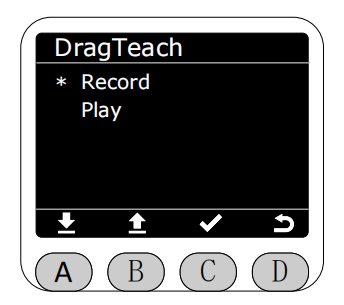
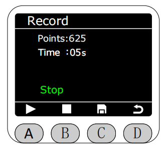
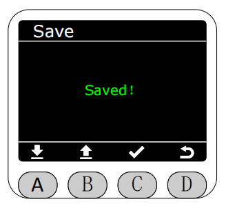
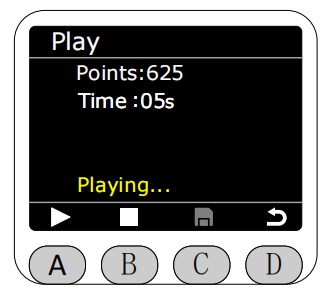

# DragTeach

In the Program interface, select the asterisk (*) to enable drag-and-drop teaching. 

Press the C key to enter drag-and-drop teaching mode.

**The production folder in myStudio Pro contains published track files, while the test folder contains unpublished track files.**

Select the Record function and press the C key to enter the recording interface. It defaults to a stopped state upon entry; you can exit the interface directly at this point. Press the A key to start recording. During recording, the end light strip will be solid yellow. Saving is not allowed during recording or pausing. **The maximum recording time is 120 seconds.** **

You can press the A key to pause recording during the recording process. At this time, the end light strip will be solid blue.

Press the B key to stop recording. At this time, the end light strip will be solid green. After stopping recording, you can press the C key to save.

Then the interface redirects to the save screen. You can choose to save to RAM or Flash.

If saved to RAM, the recorded track files will be lost after a machine restart.

**If saved to Flash, the recorded track files will not be lost after a machine restart. Track files saved in Flash can be uploaded to the myCobot Pro test folder and named tpr-1. **

**Each save to Flash is an overwrite save, meaning only the most recently recorded track file saved to Flash is retained. Files uploaded to myCobot Pro will be named in tpr-x format, where x represents the number of uploads.**

After selecting the save path, press the C key; it will display "Saving."

After approximately 3 seconds, a "Save Successful" screen will appear. This screen will then automatically redirect back to the drag-and-drop teaching interface after approximately 2 seconds.

** 

During recording, if the recording time exceeds the maximum limit or the recording exits without saving, a warning interface will pop up. At this time, the end light strip will flash red for 1 second.

After saving the track file, you can select the Play function in the DragTeach interface to play the most recently saved track file.

**The track playback defaults to infinite loop.**

The playback path can be selected to play from RAM or from Flash.

After entering the playback interface, press the A key to start playback. The end light strip will flash yellow for 1 second.

Pressing the A button again during playback will pause playback; the LED strip will then be solid blue.

Pressing the B button will stop playback; the LED strip will then be solid green.

After stopping playback, you can choose whether to upload to BlocklyRunner. If you choose to upload, the track file will be saved in the myStudio Pro production folder. **Files saved in RAM cannot be uploaded to the myStudio Pro production folder; they can only be played in the drag-and-drop teaching interface. Files saved in Flash can be uploaded to the myStudio Pro production folder.**

After selecting the save path, press the C key; it will display "Saving in progress."

After approximately 3 seconds, a "Saved Successfully" screen will appear. This screen will then automatically redirect back to the playback screen after approximately 2 seconds.

When attempting to play a track, a warning will be displayed if neither playback path has a file available. If one path has a file but the other does, clicking on it will also display a corresponding warning. At this moment, the red light on the end LED strip flashes for 1 second.

[← Previous Chapter](./5.4.1-home.md) |[Next Page →](./5.4.3-blocklyrunner.md)