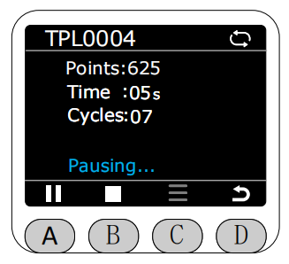

# BlocklyRunner

In the Program interface, select the BlocklyRunner function by the asterisk.

After entering the BlocklyRunner function, it will first check if there are any published track files in the myStudio Pro production folder.
**The production folder in myStudio Pro contains published track files, while the test folder contains unpublished track files. BlocklyRunner only displays published track files.**

If no published track files are found, an error message will be displayed. At this time, the end-of-line indicator light will flash red for 1 second.

If a published track file exists, it will be displayed in the BlocklyRunner interface, and you can select to play it.

After selecting a published track file, its status will be checked first.

If the file is normal, press the A key to start playback.

**During playback, the current loop status of the track file will be displayed in the upper right corner of the screen. Gray indicates single loop playback, white indicates infinite loop playback, and the default is infinite loop playback.**

**Before the track file has started or stopped executing, you can press the C key's menu option to delete the track file, perform single playback, or loop playback.** **
** If you select loop playback, playback will automatically restart after the track file finishes playing. The icon indicated by the arrow will turn white.

**If you select single playback, playback will automatically stop after the track file finishes playing. The icon indicated by the arrow will turn gray.

Pressing the A button again while playing will pause playback.

Press the B key to stop playback.

If you choose to delete the track file.

When you click delete, you will be prompted to confirm the deletion of the track file. 

After confirmation, a message indicating successful deletion will pop up. After the deletion operation, the corresponding track file in the myStudio Pro production folder will also be deleted synchronously. You need to manually return after deletion; returning will redirect to the interface that reads the myStudio Pro production folder.

[← Previous Page](./5.4.2-dragteach.md) |[Next Page →](./5.4.4-quickmove.md)